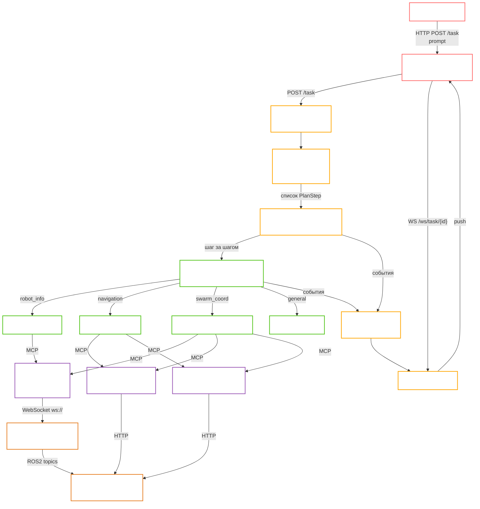

# Orchestrator — агентная оркестрация для роя роботов

Микросервис на базе **OpenAI Agents SDK**, выступающий интеллектуальной прослойкой между пользователем и инфраструктурой управления роботами. Принимает запросы на естественном языке, строит план, маршрутизирует шаги к специализированным агентам, вызывает инструменты через MCP-серверы и транслирует результат в реальном времени через WebSocket.

---

## Быстрый старт

```bash
uv sync
uv run uvicorn orchestrator.app:app --host 0.0.0.0 --port 8000
```

### Docker (dev)

```bash
docker compose -f docker/docker-compose.dev.yml up --build
```

Поднимает 5 сервисов:

| Сервис | Порт | Описание |
| --- | --- | --- |
| `orchestrator` | 8000 | FastAPI + Agents SDK |
| `mission-control-mcp` | 8010 | MCP-сервер Mission Control API (SSE) |
| `mission-dispatch-mcp` | 8011 | MCP-сервер Mission Dispatch API (SSE) |
| `ros-msp` | 8012 | MCP-сервер ROS2 через rosbridge WebSocket (FastMCP SSE) |
| `redis` | 6379 | Хранилище сессий |

Код оркестратора монтируется в контейнер через volume с hot-reload.

---

## Конфигурация

Переменные окружения задаются в `src/orchestrator/config/.env` (см. `.env.example`):

```
# Транспорт MCP-серверов (sse = контейнеры, stdio = локальный subprocess)
MISSION_CONTROL_TRANSPORT=sse
MISSION_CONTROL_MCP_URL=http://mission-control-mcp:8000/sse

MISSION_DISPATCH_TRANSPORT=sse
MISSION_DISPATCH_MCP_URL=http://mission-dispatch-mcp:8000/sse

ROS_MSP_TRANSPORT=sse
ROS_MSP_MCP_URL=http://ros-msp:8000/sse

# rosbridge (машина с ROS2 workspace)
ROSBRIDGE_IP=195.225.110.91
ROSBRIDGE_PORT=9090

# Внешние API
MISSION_CONTROL_URL=http://195.225.110.91:8050
MISSION_DISPATCH_URL=http://185.55.57.82:8051

# Модель
AGENTS_PROVIDER=vllm           # openai | vllm
AGENTS_MODEL=Qwen/Qwen2.5-7B-Instruct
AGENTS_TEMPERATURE=1.0

# Поведение планировщика
PLAN_REPLAN_MAX=1              # макс. повторных планирований при сбое
```

---

## HTTP API

| Метод | Путь | Описание |
| --- | --- | --- |
| `POST` | `/task` | Принять задачу; `?run=false` — только создать без запуска |
| `GET` | `/task/{id}/status` | Текущий статус задачи |
| `GET` | `/task/{id}/plan` | Список шагов плана с их статусами |
| `GET` | `/task/{id}/logs` | Исторический лог |
| `GET` | `/task/{id}/events?after_seq=N` | Потоковые события начиная с порядкового номера N |
| `POST` | `/task/{id}/events` | Внешний push события (воркеры, MCP-серверы) |
| `POST` | `/task/{id}/run` | Запустить отложенную или pending задачу |
| `POST` | `/task/{id}/cancel` | Отменить задачу (чистая остановка всех шагов) |
| `POST` | `/task/{id}/replan` | Пересобрать план; `?run=true` — сразу запустить |
| `WS` | `/ws/task/{id}` | WebSocket-стрим событий задачи |

Interface-сервис (backend + frontend) обращается напрямую к этим эндпоинтам и WebSocket без промежуточного gateway.

---

## Архитектура



---

## Поток выполнения задачи

1. **Interface** отправляет `POST /task` с промптом → получает `task_id`, открывает `WS /ws/task/{id}`.
2. **Orchestrator** создаёт запись задачи в `TaskStore`, публикует событие `"Task accepted"`.
3. **Planner** (эвристический) декомпозирует промпт на шаги: шаг анализа (Router), шаг сбора контекста (RobotInfo), один или несколько шагов выполнения (Navigation / SwarmCoordinator).
4. **PlanRunner** исполняет шаги последовательно:
   - Перед каждым шагом проверяет статус задачи (если `canceled` или `failed` — прекращает).
   - Передаёт шаг **Router Agent**, который классифицирует его и выполняет handoff к специализированному агенту.
   - Специализированный агент вызывает инструменты через MCP (создание миссии, опрос статуса и т.д.).
5. Все события (старт шага, вызов инструмента, результат, ошибка) пишутся в **StreamCollector** и сразу транслируются через WebSocket.
6. После завершения всех шагов задача переходит в `completed`.

---

## Fallback-ы и устойчивость

| Уровень | Поведение |
| --- | --- |
| **Шаг плана** | До `max_attempts=2` попыток на шаг. При неустранимой ошибке шаг помечается `failed`. |
| **Весь план** | При провале плана строится новый план и запускается повторно (до `PLAN_REPLAN_MAX=1`). |
| **Превышение лимита** | Задача переходит в `failed`, все незавершённые шаги — в `canceled`. |
| **Отмена** | `POST /task/{id}/cancel` — немедленная остановка, шаги помечаются `canceled`. Если раннер уже запущен — он завершает текущий шаг и выходит без старта следующих. |
| **Ручной перезапуск** | `POST /task/{id}/replan?run=true` — пересобрать план и запустить заново. |
| **Внешние события** | `POST /task/{id}/events` — внешние агенты или воркеры могут напрямую пушить статус `failed`/`completed`, обновлять шаги плана и писать в лог. |

> **Ограничение:** оркестратор **не поллирует** выполнение миссии роботом автоматически. После отправки `send_mission()` агент считает шаг завершённым по ответу API. Для отслеживания фактического выполнения промпт агента должен явно инструктировать вызов `get_mission_status()` в цикле до перехода в `COMPLETED`/`FAILED`.

---

## Поддерживаемые сценарии

| Сценарий | Агент | MCP-инструменты |
| --- | --- | --- |
| Статус роботов (батарея, позиция) | RobotInfo | `get_robot_status`, `get_topics` (ros-msp) |
| Навигация одного робота в точку | Navigation | `submit_navigation_mission` (MissionControl) |
| Отправка робота на зарядку | Navigation | `submit_charging_mission`, `submit_undock_mission` |
| Опрос очереди и статуса миссий | Navigation | `get_mission_status`, `get_fleet_summary` (MissionDispatch) |
| Координация нескольких роботов | SwarmCoordinator | `plan_route`, `create_mission`, `send_mission` |
| ROS2-топики и ноды | RobotInfo / Swarm | `get_topics`, `get_nodes`, `subscribe_topic` (ros-msp) |
| Общий вопрос без инструментов | General | — |

---

## Планировщик

`Planner` — это **эвристическая** функция (не LLM-агент), которая строит детерминированный план из промпта:

1. **Шаг 1** — `Router`: анализ запроса.
2. **Шаг 2** — `RobotInfo`: сбор контекста (список роботов, статусы).
3. **Шаг 3+** — `Navigation` или `SwarmCoordinator`: выполнение целей.

Выбор агента для исполнительного шага:
- Два и более robot\_id в промпте или ключевые слова «рой / swarm / group» → `SwarmCoordinator` (добавляет `plan_route` в tools).
- Иначе → `Navigation`.

---

## MCP-серверы

### mission-control-mcp
Обёртка над HTTP API Mission Control (`http://195.225.110.91:8050`).
- Отправка навигационной миссии с маршрутными точками
- Зарядка / отстыковка
- Работа с картами

### mission-dispatch-mcp
Обёртка над HTTP API Mission Dispatch (`http://185.55.57.82:8051`).
- Список роботов и их состояние (IDLE, ON\_TASK, CHARGING…)
- Статус миссий (PENDING, RUNNING, COMPLETED, FAILED…)
- Диспетчеризация миссий
- Сводка по флоту

### ros-msp
FastMCP-сервер, подключающийся к **rosbridge WebSocket** (`ws://195.225.110.91:9090`).
Не требует ROS2 на машине с оркестратором — только сетевой доступ к rosbridge.

Инструменты (через rosbridge):
- Топики: `get_topics`, `get_topic_type`, `subscribe_topic`
- Ноды: `get_nodes`, `get_node_details`
- Сервисы и экшены ROS2
- Параметры (`get_parameter`, `set_parameter`)
- Подключение к роботу: `connect_to_robot(ip, port)`

**Требование:** на машине `195.225.110.91` в контейнере `vda5050_client` должен быть запущен `rosbridge_server` с открытым портом 9090:
```bash
ros2 launch rosbridge_server rosbridge_websocket_launch.xml
```

### Транспорт MCP

| Режим | Когда | Конфигурация |
| --- | --- | --- |
| `sse` (Docker) | Все три MCP работают как контейнеры | `*_TRANSPORT=sse`, `*_MCP_URL=http://<service>:8000/sse` |
| `stdio` (local) | Локальная разработка без Docker | `*_TRANSPORT=stdio`, `*_COMMAND`, `*_ARGS` |

---

## Управление сессиями

Redis (или in-memory при отсутствии) хранит контекст сессии для поддержки диалога:
- последний использованный `robot_id`
- история запросов
- произвольные данные из `session_data` запроса

`POST /task` принимает опциональное поле `session_data` для передачи начального контекста.

---

## Структура проекта

```
orchestrator/
├── docker/
│   ├── docker-compose.dev.yml
│   ├── Dockerfile                  # образ оркестратора
│   ├── mission-control-mcp/        # MCP Mission Control (mcp + SSE)
│   ├── mission-dispatch-mcp/       # MCP Mission Dispatch (mcp + SSE)
│   └── ros-msp/                    # MCP ROS2 (fastmcp + rosbridge)
└── src/orchestrator/
    ├── agents/
    │   ├── mcp.py                  # конфигурация MCP-серверов
    │   ├── prompts.py              # системные промпты агентов
    │   └── router.py               # handoff-конфигурация роутера
    ├── api/
    │   ├── routes/task_routes.py   # HTTP + WebSocket эндпоинты
    │   └── schemas.py
    ├── config/
    │   ├── settings.toml
    │   ├── .env                    # рабочая конфигурация
    │   └── .env.example
    └── services/
        ├── agents_sdk.py           # AgentsSDKExecutor
        ├── orchestrator_runtime.py # build_plan + run_task
        ├── plan_runner.py          # пошаговый исполнитель
        ├── planner.py              # эвристический builder плана
        ├── streaming.py            # StreamCollector
        ├── task_application_service.py
        ├── task_event_ingestion_service.py
        └── tasks.py                # TaskStore + TaskInfo
```
