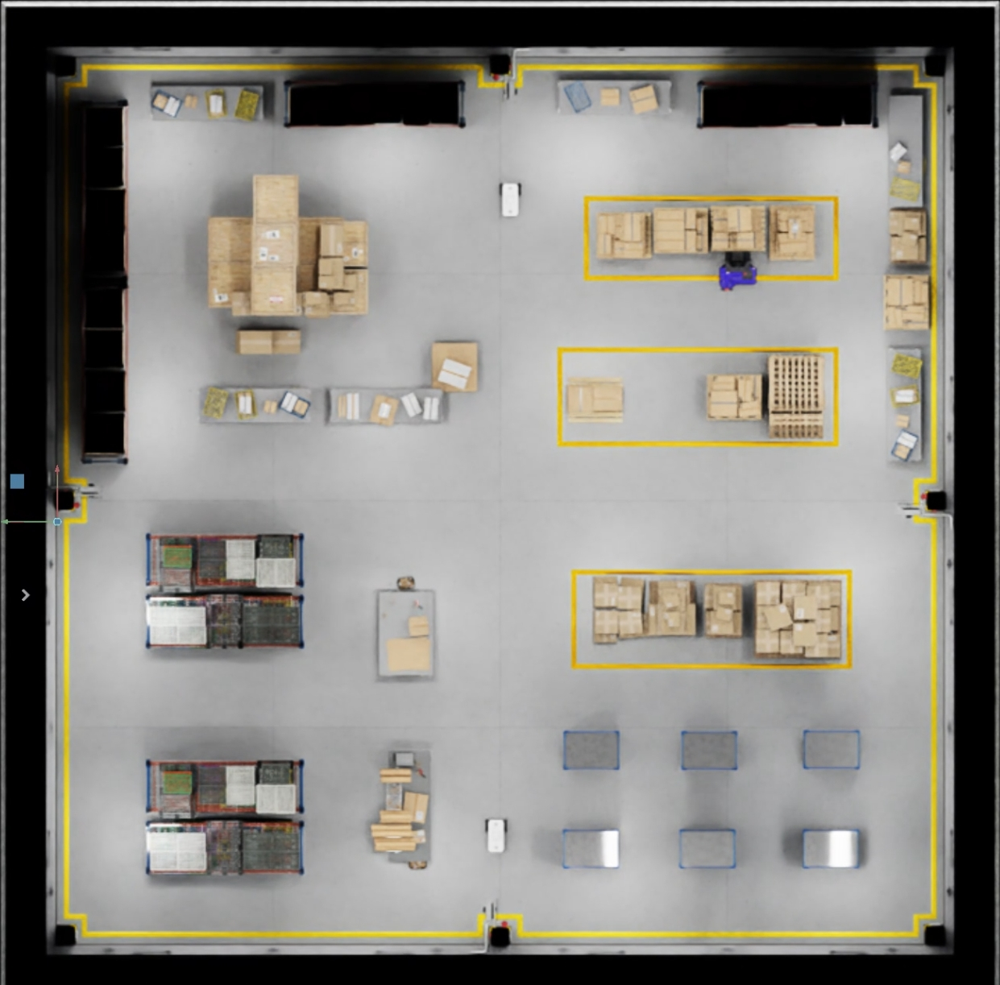

# NVIDIA Isaac Sim

## Пример среды



## Описание

Проект запускает NVIDIA Isaac Sim через Docker Compose и веб-просмотрщик для доступа к симулятору из браузера.

Основные файлы:

```text
./Makefile
./IsaacSim/tools/docker/docker-compose.yml
./IsaacSim/tools/docker/.env
```

Файл `.env` должен находиться строго по пути:

```text
./IsaacSim/tools/docker/.env
```

## Требования

Перед запуском убедитесь, что установлены:

- Docker;
- Docker Compose;
- NVIDIA Driver;
- NVIDIA Container Toolkit;
- доступ к Docker-образу Isaac Sim в NVIDIA NGC;
- минимум 10+ ГБ свободного места для загрузки образа.

## Создание `.env` файла

Файл `.env` можно создать автоматически через `Makefile`.

Создайте `.env`:

```bash
make env
```

Будет создан файл:

```text
./IsaacSim/tools/docker/.env
```

Пример `.env`

```text
./IsaacSim/tools/docker/.env.example
```

## Быстрый запуск

Из корня проекта:

```bash
make up
```

Команда `make up` выполнит:

1. создание файла `./IsaacSim/tools/docker/.env`;
2. сборку контейнеров;
3. запуск Isaac Sim и web-viewer в фоне.

## Запуск без Makefile

```bash
docker compose -p isim -f tools/docker/docker-compose.yml up --build -d
```

## Проверка работы

Показать статус контейнеров:

```bash
make ps
```

Показать все логи:

```bash
make logs
```

Показать логи web-viewer:

```bash
make logs-web
```

Показать логи Isaac Sim:

```bash
make logs-sim
```

В логах Isaac Sim дождитесь сообщения о готовности приложения, например:

```text
app ready
```

## Доступ в браузере

После запуска web-viewer будет доступен по адресу:

```text
http://localhost:8210
```

Если в `.env` изменён параметр `WEB_VIEWER_PORT`, используйте соответствующий порт.

Например:

```env
WEB_VIEWER_PORT=8220
```

Тогда адрес будет:

```text
http://localhost:8220
```

## Настройка WebRTC-хоста

Параметр:

```env
ISAACSIM_HOST=195.225.110.91
```

используется для WebRTC-стриминга Isaac Sim.

Если подключение выполняется с этой же машины, можно использовать:

```env
ISAACSIM_HOST=127.0.0.1
```

Если подключение выполняется с другого устройства, укажите LAN или публичный IP сервера.

Важно: web-viewer использует это значение на этапе сборки. После изменения `ISAACSIM_HOST` контейнеры нужно пересобрать:

```bash
make up
```

или напрямую:

```bash
docker compose -p isim -f tools/docker/docker-compose.yml up --build -d
```

## Управление контейнерами

Перезапустить контейнеры:

```bash
make restart
```

Остановить контейнеры:

```bash
make down
```

Остановить контейнеры и удалить volumes:

```bash
make clean
```

Полностью очистить Docker build cache и неиспользуемые volumes:

```bash
make prune
```

## Подключение к контейнеру Isaac Sim

```bash
make shell
```

## Переопределение параметров запуска

Параметры `.env` можно переопределить при вызове `make`.

Использовать только одну GPU:

```bash
make up GPU_DEVICE=0
```

Изменить порт web-viewer:

```bash
make up WEB_VIEWER_PORT=8220
```

Изменить IP для WebRTC:

```bash
make up ISAACSIM_HOST=127.0.0.1
```

Изменить директорию хранения данных:

```bash
make up ISAAC_SIM_DATA=/absolute/path/to/isaac-sim
```

## Полезные команды

```bash
make help       # Показать список команд
make env        # Создать ./tools/docker/.env
make up         # Собрать и запустить контейнеры
make ps         # Показать статус контейнеров
make logs       # Показать все логи
make logs-web   # Показать логи web-viewer
make logs-sim   # Показать логи isaac-sim
make restart    # Перезапустить контейнеры
make down       # Остановить контейнеры
make clean      # Остановить контейнеры и удалить volumes
make prune      # Очистить Docker build cache и volumes
make shell      # Открыть shell внутри isaac-sim
```

## Важные замечания

- Файл `.env` должен находиться по пути `./IsaacSim/tools/docker/.env`.
- В `ISAAC_SIM_DATA` нужно использовать только абсолютный путь.
- Символ `~` в путях Docker Compose не раскрывается.
- Для работы с GPU нужен NVIDIA Container Toolkit.
- Для загрузки Docker-образа Isaac Sim требуется минимум 10+ ГБ свободного места.
- Если меняется `ISAACSIM_HOST`, нужен запуск с пересборкой через `make up`.
- Если Isaac Sim не запускается, сначала проверьте логи командой `make logs-sim`.