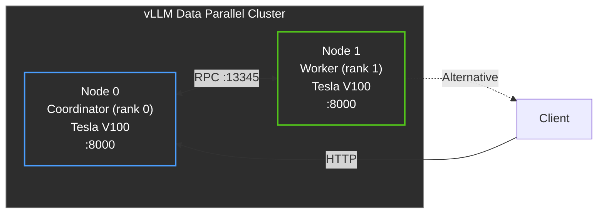

# vLLM Service — Data Parallel Deployment

Сервис для развертывания LLM моделей в режиме Data Parallel с использованием фреймворка vLLM. Поддерживает распределенный инференс на нескольких GPU-нодах.

## Архитектура



## Быстрый старт

### 1. Настройка нод

**Node 0 (Coordinator)** — первая нода:
```bash
cp src/vllm_service/config/.env.node0 src/vllm_service/config/.env
# Отредактируйте src/vllm_service/config/.env, установите VLLM_DATA_PARALLEL_ADDRESS = IP этой ноды
./deploy.sh build
./deploy.sh up
```

**Node 1 (Worker)** — вторая нода:

```bash
cp src/vllm_service/config/.env.node1 src/vllm_service/config/.env
# Отредактируйте src/vllm_service/config/.env, установите VLLM_DATA_PARALLEL_ADDRESS = IP ноды 0
./deploy.sh build
./deploy.sh up
```

### 2. Проверка работы

```bash
# Проверка статуса
./deploy.sh status

# Просмотр логов
./deploy.sh logs

# Тестирование API
curl http://localhost:8000/health
```

### Настройка использования GPU-памяти

Если на узле уже работают другие процессы или GPU занят не полностью, уменьшите
`VLLM_GPU_MEMORY_UTILIZATION` в `src/vllm_service/config/.env`, чтобы сервис
запустился без ошибок `Free memory on device cuda:0 [...] is less than desired`.
Например, `0.75` оставит достаточный запас памяти и предотвратит сбои при старте.

## Структура проекта

| Файл | Описание |
| --- | --- |
| Dockerfile | Docker образ с uv и vLLM |
| docker-compose.yml | Конфигурация для развертывания на одной ноде |
| `src/vllm_service/config/.env.node0` | Шаблон переменных окружения для координатора |
| `src/vllm_service/config/.env.node1` | Шаблон переменных окружения для воркера |
| deploy.sh | Скрипт развертывания (Linux/macOS) |
deploy.bat Скрипт развертывания (Windows)

## Конфигурация

### Переменные окружения

| Переменная | Описание | Node 0 | Node 1 |
| --- | --- | --- | --- |
| VLLM_MODEL_NAME | Имя модели на HuggingFace | Qwen/Qwen2.5-7B-Instruct | Qwen/Qwen2.5-7B-Instruct |
| VLLM_DATA_PARALLEL_SIZE | Общее количество нод | 2 | 2 |
| VLLM_DATA_PARALLEL_RANK | Ранг текущей ноды | 0 | 1 |
| VLLM_DATA_PARALLEL_ADDRESS | IP координатора | IP этой ноды | IP ноды 0 |
| VLLM_DATA_PARALLEL_RPC_PORT | Порт для RPC | 13345 | 13345 |
| VLLM_PORT | Порт для API | 8000 | 8000 |
| VLLM_HOST | Хост для API | 0.0.0.0 | 0.0.0.0 |
| VLLM_API_KEY | API ключ (опционально) | - | - |

### Сетевые требования

· Ноды должны иметь сетевую доступность друг к другу
· Порт RPC (13345) должен быть открыт между нодами
· Порт API (8000) открыт для клиентских подключений

### Пример .env для Node 0

```bash
VLLM_MODEL_NAME=Qwen/Qwen2.5-7B-Instruct
VLLM_DATA_PARALLEL_SIZE=2
VLLM_DATA_PARALLEL_RANK=0
VLLM_DATA_PARALLEL_ADDRESS=10.0.0.1
VLLM_DATA_PARALLEL_RPC_PORT=13345
VLLM_PORT=8000
VLLM_HOST=0.0.0.0
VLLM_GPU_MEMORY_UTILIZATION=0.9
VLLM_MAX_MODEL_LEN=4096
VLLM_MAX_NUM_SEQS=256
VLLM_LOG_LEVEL=INFO
```

### Пример .env для Node 1

```bash
VLLM_MODEL_NAME=Qwen/Qwen2.5-7B-Instruct
VLLM_DATA_PARALLEL_SIZE=2
VLLM_DATA_PARALLEL_RANK=1
VLLM_DATA_PARALLEL_ADDRESS=10.0.0.1
VLLM_DATA_PARALLEL_RPC_PORT=13345
VLLM_PORT=8000
VLLM_HOST=0.0.0.0
VLLM_GPU_MEMORY_UTILIZATION=0.9
VLLM_MAX_MODEL_LEN=4096
VLLM_MAX_NUM_SEQS=256
VLLM_LOG_LEVEL=INFO
```

## Или использование docker compose напрямую:

```bash
docker compose build
docker compose up -d
docker compose logs -f
docker compose down
docker compose down -v  # полная
```

## Тестирование API

### Проверка готовности сервиса

```bash
# Health check
curl http://localhost:8000/health

# Ready check
curl http://localhost:8000/ready

# Список доступных моделей
curl http://localhost:8000/v1/models
```

### Отправка запроса

```bash
curl -s -X POST http://localhost:8000/v1/chat/completions \
  -H "Content-Type: application/json" \
  -d '{
    "model": "Qwen/Qwen2.5-7B-Instruct",
    "messages": [
      {"role": "user", "content": "Привет, как дела?"}
    ],
    "temperature": 0.7,
    "max_tokens": 512
  }'
```

### Пример ответа

```json
{
  "id": "chatcmpl-abc123",
  "object": "chat.completion",
  "created": 1711881600,
  "model": "Qwen/Qwen2.5-7B-Instruct",
  "choices": [
    {
      "index": 0,
      "message": {
        "role": "assistant",
        "content": "Привет! У меня всё отлично, спасибо. Чем могу помочь?"
      },
      "finish_reason": "stop"
    }
  ],
  "usage": {
    "prompt_tokens": 12,
    "completion_tokens": 18,
    "total_tokens": 30
  }
}
```
