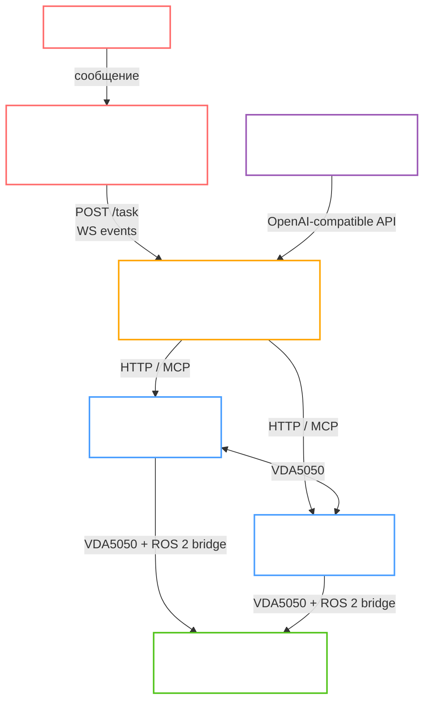

# Демонстрация работы

[Яндекс-диск](https://disk.yandex.ru/i/7aUTWh48tYnPbA)

# Документация: AgentsSwarm

## Официальное название:

> Организация кооперативного восприятия сцены в группе автономных агентов на основе обмена визуальной информацией (Cooperative Visual Perception in Multi-Agent Systems)

## Рабочее название:

> Автономный рой роботов — AgentsSwarm

---

## Компоненты архитектуры системы

| Компонент | Ветка | Тип | Статус |
|-----------|-------|-----|--------|
| [interface](https://github.com/deneal123/AgentsSwarm/tree/interface) | `interface` | Авторская разработка | ✅ Завершён |
| [orchestrator](https://github.com/deneal123/AgentsSwarm/tree/orchestrator) | `orchestrator` | Авторская разработка | ✅ Завершён |
| [vllm_service](https://github.com/deneal123/AgentsSwarm/tree/vllm_service) | `vllm_service` | Авторская разработка | ✅ Завершён |
| [isaac_mission_control](https://github.com/deneal123/AgentsSwarm/tree/isaac_mission_control) | `isaac_mission_control` | Форк NVIDIA + доработки | ✅ Завершён |
| [isaac_mission_dispatch](https://github.com/deneal123/AgentsSwarm/tree/isaac_mission_dispatch) | `isaac_mission_dispatch` | Форк NVIDIA + доработки | ✅ Завершён |
| [nvidia_isaac_simulation](https://github.com/deneal123/AgentsSwarm/tree/nvidia_isaac_simulation) | `nvidia_isaac_simulation` | Официальный NVIDIA (без изменений) | ✅ Использован |
| [workspace_isaac_simulation](https://github.com/deneal123/AgentsSwarm/tree/workspace_isaac_simulation) | `workspace_isaac_simulation` | Форк NVIDIA + ROS 2 пакеты | ✅ Завершён |
| [smolvla_tools](https://github.com/deneal123/AgentsSwarm/tree/smolvla_tools) | `smolvla_tools` | Авторская разработка (эксперимент) | 🔬 Зарезервировано |

---

## Общая архитектура системы

---

## TODO (актуальный план)

### 1. NVIDIA Isaac Sim

Официальная платформа симуляции роботов от NVIDIA. Использована без изменений исходного кода — только настройка сцены, Action Graph и ROS 2 bridge.

#### 1.1 Подготовка окружения
- [x] Подготовка ROS 2 workspace в Docker-контейнере (Ubuntu 24.04, ROS 2 Jazzy) для разработки и запуска launch-файлов
- [x] Настройка rosbridge WebSocket-сервера для публикации данных из Isaac Sim в ROS 2 топики
- [x] Очень длительная отладка Docker-образа workspace: настройка DDS bridge, зависимостей, монтирования

#### 1.2 Запуск симуляции
- [x] Docker Compose конфигурация для запуска Isaac Sim в headless-режиме с Web Viewer (удалённый доступ к интерфейсу)

#### 1.3 Настройка сцены
- [x] Создание/выбор сцены из NVIDIA Asset Store (Carter warehouse)
- [x] Настройка Action Graph роботов, назначение пространств имён (namespaces) для нескольких роботов

#### 1.4 Проверка данных
- [x] Проверка публикации данных из Isaac Sim в ROS 2 топики (одометрия, лидар, камера)

#### 1.5 Isaac ROS Mission Client (VDA5050)
- [x] Запуск пакета `isaac_ros_mission_client` (VDA5050) из workspace
- [x] Подготовка launch-конфигурации для нескольких роботов
- [x] Генерация occupancy map и `.yaml`-конфигураций для Mission Control

#### 1.6 Isaac ROS Cloud Control
- [x] Проверка работоспособности пакета `isaac_ros_cloud_control` в собранном workspace
- [x] Подготовка ROS 2 launch-команд для нескольких роботов

---

### 2. Mission Control (форк NVIDIA)

**Репозиторий**: форк [nvidia-isaac/mission-control](https://github.com/nvidia-isaac/mission-control), подмодуль `isaac_mission_control/MissionControl`.

Сервис построения дерева поведения задач. Использует occupancy map, строит граф карты, подбирает оптимальные маршруты (интеграция с NVIDIA cuOpt) и делегирует выполнение через Mission Dispatch по протоколу VDA5050.

#### 2.1 Развёртывание
- [x] Docker Compose конфигурация со всем стеком: cuOpt, Mosquitto, PostgreSQL, mission-database, mission-dispatch, wpg, mission-control, waypoint_ui
- [x] Длительная настройка образов и окружения для совместной работы всех сервисов

#### 2.2 Авторские исправления и доработки (форк)
- [x] **Исправление endpoint `push_map`**: обнаружено использование несуществующего endpoint, заменено на актуальные методы `map/update_robot`, `map/metadata`
- [x] **Исправление импорта Pydantic**: ошибка импорта в `waypoint_selection_ui`, из-за которой сервис не запускался
- [x] **Исправление пути waypoint entrypoint** и конфигурации хоста/порта
- [x] Несколько последовательных fix-коммитов по стабилизации (см. коммиты `Fix: waypoint fix path`, `Fix: import time`, `Fix: upload map`)
- [x] **Revert**: откат нестабильного изменения (коммит `revert`)

#### 2.3 Тестирование
- [x] Проверка подключения и инициализации конфигураций роботов
- [x] Проверка доставки данных от `vda5050_client_bringup` до сервисов Mission Control/Dispatch
- [x] Подтверждение статуса "online" для роботов
- [x] Пробный запуск миссии через Mission Dispatch Swagger
- [x] Получение координат для миссии через `waypoint_ui`
- [x] Проверка корректного построения дерева поведения и передачи миссий роботам в симуляторе

---

### 3. Mission Dispatch (форк NVIDIA)

**Репозиторий**: форк [nvidia-isaac/mission-dispatch](https://github.com/nvidia-isaac/mission-dispatch), подмодуль `isaac_mission_dispatch/MissionDispatch`.

VDA5050-совместимый облачный сервис очереди миссий. Принимает миссии, отправляет их роботам через MQTT (Mosquitto), отслеживает статусы через PostgreSQL.

#### 3.1 Авторские исправления и доработки (форк)
- [x] **Исправление legacy endpoint `push_map`** в `packages/controllers/server` — замена на актуальные маршруты
- [x] **Исправление конфигурации хоста** (`Fix: add host`)
- [x] Стабилизация совместной работы с Mission Control и VDA5050 клиентом

#### 3.2 Тестирование
- [x] Сквозная проверка: Isaac Sim → VDA5050 клиент → Mission Dispatch → Mission Control → обратно

---

### 4. Связка Isaac Sim ↔ Mission Control ↔ Mission Dispatch

- [x] Проверка корректности настройки: Isaac Sim ↔ ROS 2 bridge ↔ workspace
- [x] Mission Client корректно получает данные из симуляции и обновляет статус роботов
- [x] Деревья поведения Mission Control успешно исполняются роботами в Isaac Sim

---

### 5. MCP-серверы (Model Context Protocol)

**Расположение**: `orchestrator/docker/` — три MCP-сервера встроены в оркестратор как код (не подмодули), т.к. претерпели глубокие изменения относительно официальных реализаций.

#### Официальные источники (не форки, полностью переработаны):
- `mission-control-mcp` ← на основе MCP-сервера из репозитория Mission Control NVIDIA
- `mission-dispatch-mcp` ← на основе MCP-сервера из репозитория Mission Dispatch NVIDIA
- `ros-msp` ← на основе [ros-mcp-server](https://github.com/robotmcp/ros-mcp-server)

#### 5.1 Развёртывание
- [x] Docker Compose конфигурация с тремя MCP-серверами (порты 8010/8011/8012)
- [x] SSE-транспорт для всех серверов (stdio/SSE — динамический выбор через env)
- [x] Контейнеризация `ros-msp`: Dockerfile, pyproject.toml, requirements

#### 5.2 Авторские доработки (глубокие)
- [x] **mission-control-mcp**: реализованы заглушечные endpoint-ы (стояли `raise NotImplementedError`), исправлены баги, **полный переход с синхронных на асинхронные tools**
- [x] **mission-dispatch-mcp**: аналогично — реализация нереализованных методов, async-переход, исправление багов совместимости
- [x] **ros-msp**: доработка инструментов для работы с ROS 2 топиками через rosbridge WebSocket
- [x] Отключение нерелевантных инструментов, добавление кастомных инструментов для специфичных задач роя

#### 5.3 Интеграция
- [x] Подключение всех трёх MCP-серверов к Orchestrator через OpenAI Agents SDK
- [x] Проверка end-to-end вызова инструментов от агента до реального API

---

### 6. vLLM Service

**Авторская разработка с нуля.** Микросервис для сервинга LLM-моделей в OpenAI-совместимом формате в режиме Data Parallel на двух нодах (2 × Tesla V100-PCIE 32 GB).

#### 6.1 Архитектура
- [x] Координатор (rank 0) + Worker (rank 1) с RPC-синхронизацией через порт 13345
- [x] Единый OpenAI-compatible API endpoint (`:8000`) — клиенты общаются только с координатором
- [x] Модульная структура: `engine/`, `server/`, `models/`, `config/`, `utils/`

#### 6.2 Реализация
- [x] CLI-интерфейс (`uv run`) для запуска координатора и воркера
- [x] Dockerfile с uv и vLLM, docker-compose для одноузловой разработки
- [x] Скрипты развёртывания `deploy.sh` / `deploy.bat` для Linux и Windows
- [x] Шаблоны конфигурации `.env.node0` / `.env.node1`
- [x] Настройка `VLLM_GPU_MEMORY_UTILIZATION` для управления потреблением GPU-памяти

#### 6.3 Запуск моделей
- [x] Сервинг **Qwen-Instruct** (Agent Tool call) — основная модель для агентских задач
- [x] Тестирование Data Parallel режима: корректное распределение нагрузки между нодами

#### 6.4 Тестирование
- [x] Smoke-тесты API (`/health`, `/v1/chat/completions`)
- [x] Проверка совместимости с OpenAI Agents SDK (фабрика клиентов в orchestrator)

---

### 7. Orchestrator

**Авторская разработка с нуля.** Главный интеллектуальный микросервис системы. Принимает запросы на естественном языке, строит план, маршрутизирует к специализированным агентам, вызывает инструменты через MCP-серверы, транслирует результат в реальном времени через WebSocket.

**Версия**: v0.5.6 (56+ коммитов)

#### 7.1 Инфраструктура и окружение
- [x] Базовая структура FastAPI-микросервиса
- [x] Dockerfile и Docker Compose (dev: 5 сервисов — orchestrator + 3 MCP + Redis)
- [x] Переменные окружения для подключения к MCP-серверам, vLLM, Mission Control
- [x] Redis для управления сессиями и кэширования результатов MCP

#### 7.2 Агентная архитектура (OpenAI Agents SDK)

##### Router Agent
- [x] Классификация запроса в 8 категорий: `robot_info`, `navigation`, `charging`, `patrol`, `inspection`, `fleet_ops`, `swarm_coord`, `general`
- [x] Детерминированные правила приоритетов (ключевые слова → категория)
- [x] Handoff-логика к специализированным агентам

##### MissionPlanner Agent
- [x] Двухфазный агент: 1) построение детерминированного плана из шагов, 2) исполнение шагов через handoff к специализированным агентам
- [x] Контракты шагов плана: `expected_outcome`, `tools`, `depends_on`, `inputs`, `target_robots`
- [x] Повторное планирование при сбоях шага (replan)
- [x] `POST /task/{task_id}/replan` с опциональным немедленным запуском

##### MapAnalyst Agent
- [x] Получение PNG-карты и метаданных из Mission Control API
- [x] Передача карты vision-LLM для анализа в контексте навигационной задачи
- [x] Стриминг аннотированного overlay-изображения в Interface

##### RobotInfo Agent
- [x] Подключение к RosMSP MCP + MissionDispatch MCP
- [x] Инструменты: `get_fleet_summary`, `get_robot_status`, `check_robot_health`, `get_idle_robots`
- [x] Обработка edge-cases: робот не найден, недоступен

##### Navigation Agent
- [x] Подключение к MissionControl + MissionDispatch MCP
- [x] 3-шаговый обязательный алгоритм: `submit_navigation_mission` → `dispatch_mission` → polling `get_mission_status`
- [x] Polling статуса миссии до COMPLETED/FAILED (до 8 проверок)
- [x] Сценарии: зарядка (`submit_charging_mission`), отстыковка (`submit_undock_mission`)

##### Charging Agent
- [x] Специализированный агент для задач зарядки и стыковки
- [x] Обязательный алгоритм: поиск свободного дока → submit_charging_mission → dispatch → polling

##### Patrol Agent
- [x] Агент для циклического патрулирования зоны
- [x] Построение маршрута из нескольких waypoints, повторный обход

##### Inspection Agent
- [x] Агент для задач инспекции: что видит камера, обнаружение объектов, AprilTag-метки
- [x] Подъезд к объекту через навигационную миссию, анализ изображения через vision-LLM

##### FleetOps Agent
- [x] Операции над всем флотом: отмена всех миссий, зарядка всего флота, диагностика системы
- [x] Сбор аналитики и отчётов по миссиям

##### SwarmCoordinator Agent
- [x] Подключение всех трёх MCP-серверов
- [x] 4-шаговый алгоритм: поиск свободных роботов → health-check → параллельная отправка миссий → мониторинг роя
- [x] Поочерёдный polling статуса для каждого робота (до 6 раундов)
- [ ] Алгоритмы точки встречи (rendezvous) на стороне агента — инструкции есть, вычисляет LLM
- [ ] Балансировка нагрузки между роботами на основе состояния батареи

##### General Agent
- [x] Fallback-агент для справочных вопросов и приветствий

#### 7.3 Потоковая обработка (Streaming)
- [x] `StreamCollector`: агрегация событий с seq-нумерацией, буферизация для поздних подключений
- [x] WebSocket `/ws/task/{task_id}` — push всех событий в реальном времени
- [x] HTTP endpoint `GET /task/{task_id}/events` (REST-заглушка / polling)
- [x] `POST /task/{task_id}/events` — приём событий от внешних воркеров
- [x] Стриминг событий отмены задачи, маркировка шагов плана как `canceled`
- [x] Метаданные в стримах: timestamp, уровень логирования, тип события, task_id

#### 7.4 Управление сессиями и контекстом
- [x] Redis SessionManager: `get_session`, `update_session`, `clear_session`
- [x] Хранение истории диалога, последнего robot_id, кэш MCP-результатов

#### 7.5 Обработка ошибок и надёжность
- [x] Глобальный exception handler
- [x] Graceful shutdown при отключении MCP-серверов (lifespan hooks)
- [x] Retry с backoff для временных сбоев MCP (sync/async)
- [x] Guardrails / validators на вход и выход агентов

#### 7.6 API endpoints
- [x] `POST /task` — приём задачи (`run=false` для отложенного запуска)
- [x] `POST /task/{task_id}/run` — запуск отложенной задачи
- [x] `POST /task/{task_id}/cancel` — отмена с маркировкой плана
- [x] `POST /task/{task_id}/replan` — пересборка плана (`?run=true`)
- [x] `GET /task/{task_id}/status` — статус задачи
- [x] `GET /task/{task_id}/plan` — шаги плана
- [x] `GET /task/{task_id}/logs` — все логи задачи
- [x] `POST /task/{task_id}/events` — приём событий
- [x] `WS /ws/task/{task_id}` — WebSocket стриминг
- [x] `GET /health` — healthcheck

#### 7.7 Тестирование
- [x] Unit-тесты базовых сервисов (health, sessions, streaming, retry)
- [x] Контрактные тесты планировщика (агент, инструменты, target_robots, зависимости)
- [x] Тесты guardrails (валидация, категории роутера, fallback)
- [x] Интеграционные тесты HTTP API — 43/43 ✅
- [ ] Интеграционные тесты с реальными MCP-серверами (требуют Docker-окружения)
- [ ] E2E тесты полного цикла с LLM

---

### 8. Interface

**Авторская разработка с нуля.** Полноценная веб-платформа: чат с агентами, управление роем роботов, генерация файлов, история, профиль. **168 коммитов**, версия v0.5.0.

#### 8.1 Инфраструктура и окружение
- [x] **Frontend**: React + Chakra UI (CRA + craco), SPA с React Router
- [x] **Backend**: FastAPI + SQLAlchemy + Alembic (PostgreSQL), чистая архитектура (domain / application / infrastructure)
- [x] **Очереди**: RabbitMQ + Celery (фоновые задачи агентов)
- [x] **Стриминг**: Redis Streams (`chat:{thread_id}:stream`) для push событий от агентов к WebSocket
- [x] **Хранилище файлов**: MinIO / local storage
- [x] Docker Compose: dev (hot-reload backend + frontend dev server) и prod (nginx, собранный фронт)
- [x] Makefile, `build.sh`, `run.sh` для удобного управления стеком

#### 8.2 Backend — агентная архитектура
- [x] `AgentExecutionService` — роутинг запроса к нужному агенту, сборка ответа
- [x] `Orchestrator` — LLM-классификатор выбора агента
- [x] `ModelRoutingService` — выбор провайдера LLM по конфигурации (OpenAI / OpenRouter / MWS / vLLM)
- [x] `AgentSessionService` — сессии и история диалога
- [x] `AgentFileBridge` — передача файлов между агентом и хранилищем
- [x] `ReplyAssembler` — сборка финального ответа из stream-событий агента

#### 8.3 Специализированные агенты
- [x] **General** — общий чат, ответы на вопросы
- [x] **WebSearch** — поиск в интернете (tool call → внешние API)
- [x] **DeepResearch** — глубокое исследование: многошаговый поиск, синтез источников
- [x] **ImageGeneration** — генерация изображений через внешние API
- [x] **PptxGeneration** — генерация PowerPoint-презентаций
- [x] **AudioTranscribe** — транскрипция аудио
- [x] **SwarmOrchestrator** — проксирование запросов в Orchestrator-микросервис для управления роем роботов

#### 8.4 Frontend — страницы и компоненты
- [x] **Авторизация**: Login, Signup, Auth-флоу с JWT
- [x] **Chat**: основной чат с агентами, выбор агента, история диалогов, стриминг ответов
- [x] **TracePanel**: панель трассировки событий агента (tool calls, routing, stream chunks)
- [x] **Files**: управление файлами, загрузка/скачивание
- [x] **Profile**: настройки пользователя
- [x] Адаптивная тема (Chakra UI + кастомный xy-theme)

#### 8.5 WebSocket и стриминг
- [x] WebSocket Layer: auth → stream → heartbeat
- [x] `XREAD` из Redis Stream — push событий агента в реальном времени на фронтенд
- [x] Типы событий: `stream_chunk`, `agent_reply`, `routing`, `tool_call`

#### 8.6 Интеграция с Orchestrator
- [x] `SwarmOrchestratorAgent` → `POST /task` в Orchestrator
- [x] Стриминг событий от Orchestrator до Frontend через Redis Stream
- [x] Обработка ответов: план, шаги, статусы, логи

#### 8.7 Тестирование и качество кода
- [x] Pytests для backend (unit + integration)
- [x] Jest для frontend-компонентов
- [x] ESLint + Ruff (backend) — CI-совместимые линтеры
- [x] Масштабный рефакторинг: clean architecture, use-case классы, явные DTO, устранение глобальных зависимостей

---

### 9. workspace_isaac_simulation

**Форк** [IsaacSim-ros_workspaces](https://github.com/NVIDIA-Omniverse/IsaacSim-ros_workspaces) с добавлением необходимых ROS 2 пакетов. Подмодуль `IsaacSim-ros_workspaces` содержит вложенные подмодули ROS-пространства (`moveit_resources`, `topic_based_ros2_control`).

#### 9.1 Разработка
- [x] Добавление необходимых ROS 2 пакетов поверх официального workspace
- [x] Очень длительная настройка Docker-контейнера: Ubuntu 24.04 + ROS 2 Jazzy + DDS bridge
- [x] Стабилизация настройки rosbridge WebSocket-сервера
- [x] Настройка запуска `vda5050_client_bringup` для нескольких роботов одновременно
- [x] Конфигурация Makefile для удобного управления стеком

---

### 10. SmolVLA Tools (экспериментальный модуль)

**Авторская разработка.** Фреймворк для оптимизации Vision-Language-Action моделей (SmolVLA) для робототехнических приложений. Реализован полный пайплайн сжатия. **Статус: завершён как эксперимент, не интегрирован в итоговую систему.**

> Изначальная цель — реализовать кастомное VDA5050 action-действие для Mission Control, которое запускает инференс SmolVLA прямо на борту робота (Jetson Orin Nano). Направление оставлено как потенциальное развитие системы.

#### 10.1 Подготовка окружения
- [x] Настройка проекта с uv и pyproject.toml
- [x] Интеграция с HuggingFace (`lerobot/smolvla_base`, `lerobot/pusht`, `lerobot/libero`)

#### 10.2 Архитектура моделей
- [x] `TeacherModel` с загрузкой предобученных весов SmolVLA
- [x] `StudentModel` с настраиваемым коэффициентом сжатия (`student_ratio`)
- [x] Многокомпонентная функция потерь дистилляции: MSE + KL-divergence + attention transfer
- [x] Mixed precision (FP16) через `torch.cuda.amp`

#### 10.3 Пайплайн оптимизации
- [x] Stage 1: Knowledge distillation (10 эпох, температура 3.0, alpha 0.7)
- [x] Stage 2: Mixed precision inference (FP16)
- [x] Stage 3: Structured pruning (30% весов в Linear-слоях)
- [x] Stage 4: Анализ квантизации (INT8), выявление критических слоёв

#### 10.4 Результаты экспериментов
- [x] Валидация Teacher-модели на `lerobot/libero`: MSE 0.1782, R² 0.8412
- [x] Сжатие: **443× по параметрам**, 12× по VRAM (6 GB → <0.5 GB)
- [x] Ускорение инференса: **25×** (Teacher 450 ms → Student 18 ms на RTX 4090)
- [x] Метрики качества: MSE +9.1%, MAE +5.1%, R² −1.8% (>90% точности сохранено)
- [x] Per-action MAE по 7 действиям манипулятора — разница в третьем знаке

#### 10.5 Экспорт и совместимость
- [x] Экспорт Student-модели в ONNX (фиксированный вход 224×224)
- [x] Проверка совместимости с NVIDIA TensorRT (рекомендован FP16-режим)
- [x] Подготовка примеров инференса для NVIDIA Jetson Orin Nano

#### 10.6 Потенциальное развитие (не реализовано)
- [ ] Кастомный VDA5050 action-handler в Mission Control для вызова SmolVLA-инференса как действия в миссии
- [ ] Интеграция SmolVLA через Mission Dispatch + кастомное действие → индивидуальная автономность каждого робота
- [ ] Развёртывание на борту Jetson Orin Nano

---

## Технические требования для запуска полного стека

| Машина | Провайдер | Конфигурация | Назначение | Стоимость |
|--------|-----------|--------------|------------|-----------|
| Симуляция | Selectel | 4 vCPU, 16 GB RAM, RTX 4090 (24 GB VRAM), 128 GB SSD, Ubuntu 24.04, GPU driver 580 | Isaac Sim (headless) + workspace ROS 2 + Mission Control/Dispatch | 15 012,70 ₽/мес |
| Микросервисы | Selectel | 4 vCPU, 8 GB RAM, 128 GB SSD, Ubuntu 24.04 | Interface + Orchestrator + Redis + RabbitMQ + MinIO + PostgreSQL | 1 156,09 ₽/мес |
| LLM-кластер | MTS Cloud | 2 ноды × Tesla V100-PCIE (32 GB VRAM), 1.6 ТБ/нода | vLLM Data Parallel (Qwen-Instruct) | Бесплатно |
| **Итого** | | | | **16 168,79 ₽/мес** |

---

## Источники и литература

### Использованные (задействованы в проекте)

#### Симуляция и робототехника
- [x] [NVIDIA Isaac Sim](https://docs.isaacsim.omniverse.nvidia.com/)
- [x] [NVIDIA Isaac ROS](https://nvidia-isaac-ros.github.io/getting_started/index.html)
- [x] [NVIDIA Isaac ROS Repositories and Packages](https://nvidia-isaac-ros.github.io/repositories_and_packages/index.html)
- [x] [Multiple Robot ROS Navigation (Isaac Sim 4.5)](https://docs.isaacsim.omniverse.nvidia.com/4.5.0/ros_tutorials/tutorial_ros_multi_navigation.html)
- [x] [IsaacSim-ros_workspaces (официальный)](https://github.com/NVIDIA-Omniverse/IsaacSim-ros_workspaces)
- [x] [ROS 2 (Jazzy)](https://github.com/ros2)
- [x] [rosbridge_suite](https://github.com/RobotWebTools/rosbridge_suite)
- [x] [VDA5050 Protocol](https://github.com/VDA5050/VDA5050)
- [x] [NVIDIA Mission Control](https://github.com/nvidia-isaac/mission-control)
- [x] [NVIDIA Mission Dispatch](https://github.com/nvidia-isaac/mission-dispatch)
- [x] [NVIDIA cuOpt](https://docs.nvidia.com/cuopt/)

#### MCP и агентные инструменты
- [x] [OpenAI Agents SDK](https://github.com/openai/openai-agents-python)
- [x] [Model Context Protocol (MCP)](https://modelcontextprotocol.io/)
- [x] [ros-mcp-server](https://github.com/robotmcp/ros-mcp-server)
- [x] [FastMCP](https://github.com/jlowin/fastmcp)

#### LLM и инференс
- [x] [vLLM](https://github.com/vllm-project/vllm)
- [x] [Qwen2.5-Instruct (HuggingFace)](https://huggingface.co/Qwen/Qwen2.5-7B-Instruct)

#### Инфраструктура
- [x] [FastAPI](https://fastapi.tiangolo.com/)
- [x] [Redis](https://redis.readthedocs.io/en/stable/)
- [x] [RabbitMQ](https://www.rabbitmq.com/)
- [x] [Celery](https://docs.celeryq.dev/)
- [x] [PostgreSQL + SQLAlchemy](https://docs.sqlalchemy.org/)
- [x] [MinIO](https://min.io/docs/minio/linux/developers/python/API.html)
- [x] [Alembic](https://alembic.sqlalchemy.org/)
- [x] [React](https://react.dev/)
- [x] [Chakra UI](https://v2.chakra-ui.com/)

#### SmolVLA / LeRobot
- [x] [SmolVLA (HuggingFace)](https://huggingface.co/lerobot/smolvla_base)
- [x] [SmolVLA arxiv paper](https://arxiv.org/abs/2506.01844)
- [x] [LeRobot (HuggingFace)](https://github.com/huggingface/lerobot)
- [x] [LeRobot Docs](https://huggingface.co/docs/lerobot)

---

### Не использованные (изучены, отложены или заменены)

#### Альтернативные агентные фреймворки
- [ ] [LangGraph](https://docs.langchain.com/oss/python/langgraph/overview) — рассматривался как основа оркестратора, заменён OpenAI Agents SDK
- [ ] [LangChain](https://python.langchain.com/) — рассматривался, не выбран
- [ ] [AutoGen (Microsoft)](https://microsoft.github.io/autogen/) — изучен как альтернатива multi-agent координации
- [ ] [CrewAI](https://docs.crewai.com/) — изучен как альтернатива

#### NVIDIA Agent Workflows / VSS
- [ ] [NVIDIA VSS Agent](https://docs.nvidia.com/vss/3.1.0/quickstart.html) — изучен, не применён
- [ ] [NVIDIA Agent Workflows](https://docs.nvidia.com/vss/latest/adding-workflows.html) — изучен
- [ ] [video-search-and-summarization blueprint](https://github.com/NVIDIA-AI-Blueprints/video-search-and-summarization) — изучен как референс для vision-pipeline

#### Альтернативные инструменты развёртывания
- [ ] [Helm / Kubernetes](https://helm.sh/) — рассматривался для prod-развёртывания стека NVIDIA
- [ ] [NVIDIA Fleet Commander](https://developer.nvidia.com/fleet-commander) — изучен как enterprise-альтернатива Mission Control

#### Клиенты и SDK
- [ ] [RosMspClient](https://github.com/robotmcp/robotmcp_client.git) — изучен, ros-msp сервер использован напрямую

#### Память и персонализация
- [ ] [Mem0](https://mem0.ai/) — рассматривался для долгосрочной памяти агентов Interface
- [ ] [Zep](https://www.getzep.com/) — альтернатива Mem0

#### Квантизация и оптимизация моделей
- [ ] [NVIDIA TensorRT](https://developer.nvidia.com/tensorrt) — проверена совместимость с SmolVLA ONNX, не применён в prod
- [ ] [llama.cpp](https://github.com/ggerganov/llama.cpp) — рассматривался для бортового инференса на Jetson
- [ ] [Ollama](https://ollama.com/) — рассматривался как более простая альтернатива vLLM для разработки

---

### Источники литературного обзора ([REVIEW.md](./REVIEW.md))

#### Кооперативное визуальное восприятие

- [Han et al., 2023 — Collaborative Perception in Autonomous Driving: Methods, Datasets and Challenges (IEEE ITS Magazine)](https://arxiv.org/abs/2301.06262)
- [Liu et al., 2023 — Towards Vehicle-to-Everything Autonomous Driving: A Survey on Collaborative Perception (arXiv)](https://arxiv.org/abs/2308.16714)
- [Wang et al., 2020 — V2VNet: Vehicle-to-Vehicle Communication for Joint Perception and Prediction (ECCV)](https://arxiv.org/abs/2008.07519)
- [Liu et al., 2020 — When2com: Multi-Agent Perception via Communication Graph Grouping (CVPR)](https://arxiv.org/abs/2006.00176)
- [Hu et al., 2022 — Where2comm: Communication-Efficient Collaborative Perception via Spatial Confidence Maps (NeurIPS)](https://arxiv.org/abs/2209.12836)
- [Xu et al., 2022 — V2X-ViT: Vehicle-to-Everything Cooperative Perception with Vision Transformer (ECCV)](https://arxiv.org/abs/2203.10638)
- [Xu et al., 2022 — OPV2V: An Open Benchmark Dataset and Fusion Pipeline for V2V Perception (ICRA)](https://arxiv.org/abs/2109.07644)
- [Xu et al., 2022 — CoBEVT: Cooperative Bird's Eye View Semantic Segmentation with Sparse Transformers (CoRL)](https://arxiv.org/abs/2207.02202)
- [Zhou et al., 2024 — CoPeD: Advancing Multi-Robot Collaborative Perception Dataset (RA-L)](https://arxiv.org/abs/2405.14731)

#### C-SLAM и координация флота

- [Lajoie et al., 2022 — Towards Collaborative SLAM: a Survey (Field Robotics)](https://arxiv.org/abs/2108.08325)
- [Lajoie & Beltrame, 2024 — Swarm-SLAM: Sparse Decentralized Collaborative SLAM (RA-L)](https://arxiv.org/abs/2301.06230)
- [VDA/VDMA, 2022 — VDA5050 Standard v2.0 (официальная спецификация)](https://github.com/VDA5050/VDA5050)
- [van Duijkeren et al., 2023 — An Industrial Perspective on Multi-Agent Decision Making for VDA5050 (arXiv)](https://arxiv.org/abs/2311.14615)
- [Open Robotics — Open RMF (GitHub)](https://github.com/open-rmf)
- [Iovino et al., 2022 — A Survey of Behavior Trees in Robotics and AI (RAS)](https://arxiv.org/abs/2005.05842)
- [Chen et al., 2023 — FogROS2: An Adaptive Platform for Cloud and Fog Robotics (ICRA)](https://arxiv.org/abs/2205.09778)
- [Sikand et al., 2021 — Robofleet: Open Source Communication for Robot Fleets (IROS)](https://arxiv.org/abs/2103.06993)

#### LLM в робототехнике

- [Zeng et al., 2023 — Large Language Models for Robotics: A Survey (arXiv)](https://arxiv.org/abs/2311.07226)
- [Li et al., 2025 — Large Language Models for Multi-Robot Systems: A Survey (arXiv)](https://arxiv.org/abs/2502.03814)
- [Yao et al., 2023 — ReAct: Synergizing Reasoning and Acting in Language Models (ICLR)](https://arxiv.org/abs/2210.03629)
- [Ahn et al., 2022 — SayCan: Do As I Can, Not As I Say (CoRL)](https://arxiv.org/abs/2204.01691)
- [Singh et al., 2023 — ProgPrompt: Generating Situated Robot Task Plans using LLMs (ICRA)](https://arxiv.org/abs/2209.11302)
- [Pan et al., 2025 — SELP: Generating Safe and Efficient Task Plans for Robot Agents (ICRA 2025)](https://arxiv.org/abs/2409.19471)
- [Jiao et al., 2023 — Swarm-GPT: Combining LLMs with Safe Motion Planning for Drone Swarms (arXiv)](https://arxiv.org/abs/2312.01059)

#### Foundation Models и VLA

- [Brohan et al., 2023 — RT-2: Vision-Language-Action Models Transfer Web Knowledge (CoRL)](https://arxiv.org/abs/2307.15818)
- [Huang et al., 2023 — VoxPoser: Composable 3D Value Maps for Robotic Manipulation (CoRL)](https://arxiv.org/abs/2307.05973)
- [Kim et al., 2024 — OpenVLA: An Open-Source Vision-Language-Action Model (CoRL)](https://arxiv.org/abs/2406.09246)
- [OXE Collaboration, 2023 — Open X-Embodiment: Robotic Learning Datasets and RT-X Models (CoRL)](https://arxiv.org/abs/2310.08864)
- [Black et al., 2024 — π₀: A Vision-Language-Action Flow Model (Physical Intelligence)](https://arxiv.org/abs/2410.24164)
- [HuggingFace/LeRobot, 2025 — SmolVLA: A VLA Model for Affordable and Efficient Robotics (arXiv)](https://arxiv.org/abs/2506.01844)
- [Wen et al., 2025 — TinyVLA: Towards Fast, Data-Efficient VLA Models (RA-L)](https://arxiv.org/abs/2409.12514)

#### Симуляция, цифровые двойники, инференс

- [NVIDIA — Isaac Sim Multi-Robot Navigation Tutorial](https://docs.isaacsim.omniverse.nvidia.com/4.5.0/ros_tutorials/tutorial_ros_multi_navigation.html)
- [Mittal et al., 2023 — Orbit: A Unified Simulation Framework for Robot Learning (RA-L)](https://arxiv.org/abs/2301.04195)
- [Jacinto et al., 2024 — Pegasus Simulator: Isaac Sim for Multiple Aerial Vehicles (ICUAS)](https://arxiv.org/abs/2307.05263)
- [Fuller et al., 2021 — A Survey on AI-Driven Digital Twins in Industry 4.0 (Sensors MDPI)](https://doi.org/10.3390/s21196340)
- [Kwon et al., 2023 — Efficient Memory Management for LLM Serving with PagedAttention / vLLM (SOSP)](https://arxiv.org/abs/2309.06180)
- [Qwen Team, 2024 — Qwen2.5 Technical Report (arXiv)](https://arxiv.org/abs/2412.15115)
