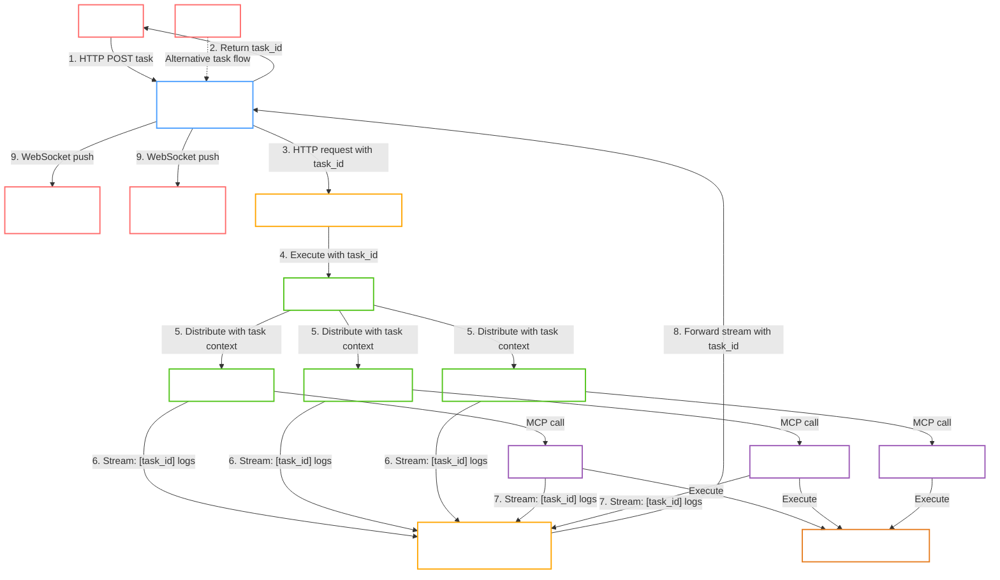

# Orchestrator — агентная оркестрация для роя роботов

Микросервис на базе **OpenAI Agents SDK**, выступающий интеллектуальной прослойкой между пользователем и инфраструктурой управления роботами. Orchestrator принимает запросы на естественном языке, маршрутизирует их к специализированным агентам, вызывает инструменты через MCP-серверы (RosMSP, MissionControl, MissionDispatch) и возвращает результат в реальном времени.


## Архитектура



---

## Поток обработки задачи

1. **Пользователь отправляет задачу** через HTTP POST на API Gateway. Задача содержит текстовое описание (например, *"Отправь carter01 на склад А"*).
2. **Gateway** создаёт уникальный `task_id`, публикует задачу в очередь RabbitMQ и немедленно возвращает `task_id` пользователю.
3. **Worker Service** забирает задачу из очереди и отправляет HTTP-запрос в Orchestrator, передавая `task_id` и текст задачи.
4. **Orchestrator** (FastAPI) принимает запрос и запускает агентскую цепочку, передавая `task_id` в контекст выполнения.
5. **RouterAgent** анализирует задачу и направляет её соответствующему специализированному агенту:
   - `RobotInfoAgent` — для запросов о состоянии роботов (батарея, позиция, список).
   - `NavigationAgent` — для навигационных задач с одним роботом.
   - `SwarmCoordinatorAgent` — для координации нескольких роботов.
6. **Специализированный агент** выполняет необходимые вызовы MCP-серверов (RosMSP, MissionControl, MissionDispatch).
7. **Все логи и промежуточные результаты** (включая вызовы инструментов, мысли агента, статусы) передаются в StreamCollector с привязкой к `task_id`.
8. **StreamCollector** агрегирует потоковые данные и отправляет их в WebSocket Manager.
9. **WebSocket Manager** сохраняет поток в буфер (`Task Stream Buffer`) и транслирует его всем клиентам, подписанным на данный `task_id` (пользователь, создавший задачу, может делиться ссылкой на выполнение с другими).
10. **Пользователь** получает потоковую выдачу через WebSocket в реальном времени: сначала видны мысли агента, затем вызовы инструментов, затем финальный ответ.

---

## Архитектурные компоненты

### 1. Orchestrator (FastAPI)
- **Task Processing Endpoint** — принимает задачу от Worker, запускает агента.
- **Stream Collector** — собирает логи и события от агентов и MCP-серверов, передаёт в WebSocket Manager.

### 2. Агентный слой (Agent Layer)
- **RouterAgent** — анализирует запрос, выполняет handoff к нужному агенту.
- **RobotInfoAgent** — работает с RosMSP.
- **NavigationAgent** — работает с MissionControl и MissionDispatch.
- **SwarmCoordinatorAgent** — работает со всеми тремя MCP-серверами.

### 3. MCP-серверы
- **RosMSP** — предоставляет инструменты для получения информации о роботах (список, статус, батарея, позиция).
- **MissionControl** — управление миссиями (создание, планирование, отмена).
- **MissionDispatch** — отправка миссий роботам и отслеживание их выполнения.

---

## Подключение MCP к агентам

```python
from agents import Agent
from agents.mcp import MCPServerStdio

# RosMSP MCP
ros_server = MCPServerStdio(
    name="ros-msp",
    params={
        "command": "uv",
        "args": ["--directory", "/path/to/ros-mcp-server", "run", "server.py"],
    },
)

# MissionControl MCP
control_server = MCPServerStdio(
    name="mission-control",
    params={
        "command": "python",
        "args": ["-m", "mission_control_mcp.server"],
        "env": {"MISSION_CONTROL_URL": "http://localhost:8050"},
    },
)

# MissionDispatch MCP
dispatch_server = MCPServerStdio(
    name="mission-dispatch",
    params={
        "command": "python",
        "args": ["-m", "mission_dispatch_mcp.server"],
        "env": {"MISSION_DISPATCH_URL": "http://localhost:8051"},
    },
)

# Специализированные агенты
robot_info_agent = Agent(
    name="RobotInfo",
    instructions=ROBOT_INFO_PROMPT,
    mcp_servers=[ros_server],
)

navigation_agent = Agent(
    name="Navigation",
    instructions=NAVIGATION_PROMPT,
    mcp_servers=[control_server, dispatch_server],
)

swarm_agent = Agent(
    name="SwarmCoordinator",
    instructions=SWARM_PROMPT,
    mcp_servers=[ros_server, control_server, dispatch_server],
)

# Роутер (без инструментов)
router = Agent(
    name="Router",
    instructions=ROUTER_PROMPT,
    handoffs=[robot_info_agent, navigation_agent, swarm_agent],
)
```

---

## System prompt для агентов (пример)

### RouterAgent

```markdown
Ты маршрутизатор. Классифицируй запрос пользователя в одну из категорий:
- robot_info: вопросы о статусе робота, позиции, батарее, списке доступных роботов.
- navigation: перемещение одного робота в точку.
- swarm_coord: координация нескольких роботов (например, "встретиться в точке А", "вместе осмотреть зону").
- general: простые приветствия или вопросы, не требующие вызова инструментов.

Если запрос содержит ID робота (например, carter01) и касается перемещения — направь к navigation.
Если упоминаются несколько роботов или рой — направь к swarm_coord.
Если спрашивают о состоянии робота — направь к robot_info.
В остальных случаях — к general.

Твой вывод — это handoff соответствующему агенту.
```

### RobotInfoAgent

```markdown
Ты агент для получения информации о роботах через RosMSP.

Доступные инструменты (через MCP):
- get_robots(): возвращает список активных namespace роботов.
- get_robot_status(robot_id): возвращает заряд батареи, позицию, состояние и т.д.

Всегда уточняй ID робота, если он не указан. Если пользователь спрашивает "всех роботов", сначала получи список через get_robots(), затем запроси статус каждого.
Представляй информацию чётко и структурированно.
```

### NavigationAgent

```markdown
Ты навигационный агент. Можешь создавать и отправлять миссии для одного робота.

Инструменты:
- create_mission(robot_id, waypoints) -> mission_id
- send_mission(robot_id, mission) -> status

Всегда запрашивай ID робота, если он не указан. После отправки подтверждай статус миссии.
```

### SwarmCoordinatorAgent

```markdown
Ты координатор роя. Ты можешь:
- Получить список всех роботов (get_robots)
- Получить детальный статус (get_robot_status)
- Спланировать маршруты (plan_route) — требует cuOpt.
- Создать и отправить миссии для нескольких роботов.

Для задач с несколькими роботами:
1. Определи целевых роботов (если не указаны — спроси пользователя).
2. Для каждого робота определи waypoints/цели.
3. Используй create_mission и send_mission для каждого.

Если задача требует сложной координации (например, точка встречи), вычисли единую точку и назначь маршруты каждому.
```

---

## Примеры потока запросов

### Навигация одного робота

Пользователь: "Отправь carter01 на склад А."

1. Gateway создаёт task_id = abc-123, публикует в очередь, возвращает ID пользователю.
2. Worker забирает задачу, вызывает Orchestrator с task_id=abc-123.
3. RouterAgent → NavigationAgent.
4. NavigationAgent проверяет robot_id = carter01, вызывает create_mission() и send_mission().
5. Все логи: "Начинаю обработку задачи abc-123", "Вызываю create_mission", "Миссия создана", "Отправляю миссию" — передаются в Stream Collector и через WebSocket — пользователю.
6. Финальный ответ: "Миссия для carter01 создана и отправлена. Статус: running."

### Координация роя

Пользователь: "Организуй встречу трёх роботов (carter01, carter02, carter03) в центре карты."

1. Gateway создаёт task_id = def-456, возвращает ID.
2. RouterAgent → SwarmCoordinatorAgent.
3. SwarmCoordinatorAgent вызывает get_robot_status для каждого, проверяет доступность.
4. Вычисляет центральную точку, для каждого создаёт миссию.
5. Отправляет миссии.
6. Пользователь видит поток: "Проверяю статус carter01... доступен", "Создаю миссию для carter01", "Создаю миссию для carter02", "Отправляю миссии", "Все миссии отправлены успешно".

---

## Управление роботами (namespaces)

- Список активных роботов получается через инструмент get_robots() (RosMSP MCP).
- Каждый инструмент MissionControl и MissionDispatch принимает параметр robot_id, который соответствует namespace робота (например, carter01).
- Если пользователь не указал robot_id, агент может:
  - Запросить уточнение через потоковый ответ (WebSocket).
  - Использовать первого доступного (для простых команд).
  - Для роя — взять всех активных.

---

## Однофазные vs двухфазные агенты

- Однофазные (RobotInfoAgent, NavigationAgent, SwarmCoordinatorAgent) — подходят для задач, которые решаются за один вызов агента. Ответ генерируется сразу, но промежуточные шаги всё равно передаются потоком.
- Двухфазные (например, MissionPlannerAgent) — полезны для сложных планов. Сначала агент возвращает структурированный план (JSON), затем каждый шаг выполняется отдельно. В Agents SDK это реализуется через потоковую обработку (Runner.run_streamed) и анализ промежуточных событий.

---

## Управление сессиями

Для поддержки диалога (уточнения робота, запоминания контекста) используется Redis (или in-memory хранилище для разработки). В начале каждой сессии создаётся ключ, где хранятся:

- последний использованный robot_id
- история запросов
- текущая активная цель

При каждом запросе контекст извлекается и передаётся в RunContextWrapper.

---

## Дальнейшее развитие

- Поддержка сложных деревьев поведения через двухфазного MissionPlannerAgent.
- Интеграция с VLLM_service для выбора оптимальной модели.
- Механизм шаринга выполнения задачи: пользователь может отправить ссылку на task_id коллеге для совместного наблюдения.
