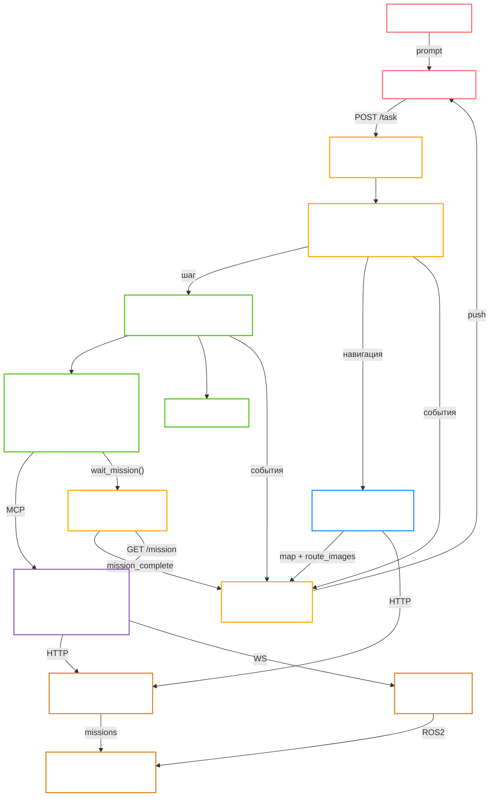

# Orchestrator — агентная оркестрация для роя роботов

Микросервис на базе **OpenAI Agents SDK**, выступающий интеллектуальной прослойкой между пользователем и инфраструктурой управления роботами. Принимает запросы на естественном языке, строит план, маршрутизирует шаги к специализированным агентам, вызывает инструменты через MCP-серверы и транслирует результат в реальном времени через WebSocket.

---

## Быстрый старт

```bash
uv sync
uv run uvicorn orchestrator.app:app --host 0.0.0.0 --port 8000
```

### Docker (dev)

```bash
docker compose -f docker/docker-compose.dev.yml up --build
```

Поднимает 5 сервисов:

| Сервис | Порт | Описание |
| --- | --- | --- |
| `orchestrator` | 8000 | FastAPI + Agents SDK |
| `mission-control-mcp` | 8010 | MCP-сервер Mission Control API (SSE) |
| `mission-dispatch-mcp` | 8011 | MCP-сервер Mission Dispatch API (SSE) |
| `ros-msp` | 8012 | MCP-сервер ROS2 через rosbridge WebSocket (FastMCP SSE) |
| `redis` | 6379 | Хранилище сессий |

Код оркестратора монтируется в контейнер через volume с hot-reload.

---

## Конфигурация

Переменные окружения задаются в `src/orchestrator/config/.env` (см. `.env.example`):

```
# Транспорт MCP-серверов (sse = контейнеры, stdio = локальный subprocess)
MISSION_CONTROL_TRANSPORT=sse
MISSION_CONTROL_MCP_URL=http://mission-control-mcp:8000/sse

MISSION_DISPATCH_TRANSPORT=sse
MISSION_DISPATCH_MCP_URL=http://mission-dispatch-mcp:8000/sse

ROS_MSP_TRANSPORT=sse
ROS_MSP_MCP_URL=http://ros-msp:8000/sse

# rosbridge (машина с ROS2 workspace)
ROSBRIDGE_IP=195.225.110.91
ROSBRIDGE_PORT=9090

# Внешние API (прямой доступ для MapAnalyst и фонового поллинга)
MISSION_CONTROL_URL=http://195.225.110.91:8050
MISSION_DISPATCH_URL=http://185.55.57.82:8051

# Модель
AGENTS_PROVIDER=vllm           # openai | vllm
AGENTS_MODEL=Qwen/Qwen2.5-7B-Instruct
AGENTS_TEMPERATURE=1.0

# Поведение агентов
AGENTS_MAX_TURNS=60            # макс. ходов агента за шаг (default: 60)

# Поведение планировщика
PLAN_REPLAN_MAX=1              # макс. повторных планирований при сбое

# Фоновый поллинг миссий
MISSION_POLL_INTERVAL=10       # интервал опроса статуса миссии в секундах (default: 10)
MISSION_DISPATCH_TIMEOUT=3600  # таймаут миссии по умолчанию в секундах
```

---

## HTTP API

| Метод | Путь | Описание |
| --- | --- | --- |
| `POST` | `/task` | Принять задачу; `?run=false` — только создать без запуска |
| `GET` | `/task/{id}/status` | Текущий статус задачи |
| `GET` | `/task/{id}/plan` | Список шагов плана с их статусами |
| `GET` | `/task/{id}/logs` | Исторический лог |
| `GET` | `/task/{id}/events?after_seq=N` | Потоковые события начиная с порядкового номера N |
| `POST` | `/task/{id}/events` | Внешний push события (воркеры, MCP-серверы) |
| `POST` | `/task/{id}/run` | Запустить отложенную или pending задачу |
| `POST` | `/task/{id}/cancel` | Отменить задачу (чистая остановка всех шагов) |
| `POST` | `/task/{id}/replan` | Пересобрать план; `?run=true` — сразу запустить |
| `WS` | `/ws/task/{id}` | WebSocket-стрим событий задачи |

Interface-сервис (backend + frontend) обращается напрямую к этим эндпоинтам и WebSocket без промежуточного gateway.

---

## Архитектура



---

## Поток выполнения задачи

1. **Interface** отправляет `POST /task` с промптом → получает `task_id`, открывает `WS /ws/task/{id}`.
2. **Orchestrator** создаёт запись задачи в `TaskStore`, публикует событие `"Task accepted"`.
3. **Planner** (LLM + эвристический fallback) декомпозирует промпт на шаги.
4. **PlanRunner** исполняет шаги последовательно:
   - Перед каждым шагом проверяет статус задачи (если `canceled` или `failed` — прекращает).
   - Шаги навигации/роя автоматически получают результат MapAnalyst в контексте.
   - MapAnalyst **не вставляется** для задач отмены миссий и запросов статуса — только для движения.
   - Специализированный агент вызывает инструменты через MCP.
5. После завершения всех шагов PlanRunner **эмитирует финальный ответ** (`user_facing=true`, `code=task_result`) с результатами агентов.
6. Все события (старт шага, вызов инструмента, завершение миссии, изображения маршрутов) пишутся в **StreamCollector** и сразу транслируются через WebSocket.

### Пример плана для навигационной задачи

```
Шаг 1 — MapAnalyst      : анализ карты, построение маршрутов, выбор лучшего
Шаг 2 — Navigation      : выполнение миссии с учётом контекста карты
```

### Пример плана для задачи отмены / статуса

```
Шаг 1 — Navigation/RobotInfo : отмена миссий или запрос статуса (без MapAnalyst)
```

---

## Фоновый поллинг миссий (`wait_mission`)

Навигационный агент **никогда не уходит в сон** — после отправки миссии он вызывает инструмент `wait_mission(mission_id)`, который **возвращается мгновенно** и запускает asyncio-задачу в фоне.

### Принцип работы

```
Агент:
  dispatch_mission(robot, x, y)         → UUID: nav_abc123
  wait_mission(mission_id="nav_abc123")  → "Polling started" (мгновенно)
  [шаг завершён]

Фоновая задача (asyncio.Task):
  каждые MISSION_POLL_INTERVAL секунд:
    GET /mission?name=nav_abc123
    state == COMPLETED → emit StreamEvent("✓ Миссия завершена")
    state == FAILED    → emit StreamEvent("✗ Миссия завершилась с ошибкой: ...")
    state == CANCELED  → emit StreamEvent("✗ Миссия отменена")

PlanRunner:
  _await_mission_jobs() → ждёт завершения фоновой задачи
  результат добавляется в финальный ответ task_result
```

**Преимущества по сравнению с циклом `get_mission_status`:**

- Токены LLM не тратятся во время ожидания
- Оркестратор не блокируется
- Нет риска исчерпать `max_turns` агента при длинных миссиях

---

## MapAnalyst — анализ карты и планирование маршрутов

Специализированный агент, вставляемый в план автоматически при любой навигационной или роевой задаче (кроме задач отмены и запросов статуса).

### Трёхфазный воркфлоу

**Фаза 1 — Предложение кандидатов**

- Скачивает актуальное изображение карты (`GET /api/v1/map`) и метаданные напрямую из Mission Control.
- Накладывает на карту маркеры всех роботов с цветовой кодировкой состояния (зелёный=IDLE, синий=ON_TASK, жёлтый=CHARGING).
- Отправляет аннотированную карту (base64 PNG) + задание в vision-модель.
- Получает ровно 3 кандидата маршрута:
  - `direct` — минимум точек, прямо к цели
  - `safe` — обходит препятствия с запасом ≥ safety\_distance + 0.3 м
  - `optimal` — баланс длины пути и безопасности

**Фаза 2 — Визуализация маршрутов**

- Для каждого кандидата отправляет waypoints в Mission Control (`POST /api/v1/visualize_route`).
- Получает PNG-изображения с нарисованными маршрутами на реальной карте.
- **Все PNG передаются в WebSocket-стрим** в событии `route_visualizations`.

**Фаза 3 — Выбор лучшего маршрута (vision LLM)**

- Сравнивает все PNG через vision-модель: эффективность, запас от стен, плавность, риск узких мест.
- Победитель + обоснование передаются в контекст следующего шага (Navigation/SwarmCoordinator).

**Нефатальная архитектура**: любой сбой (карта недоступна, визуализация упала, vision API недоступен) → план продолжается без контекста карты.

### Контекст карты для Navigation

Результат MapAnalyst содержит:

- Границы карты (resolution, x/y bounds)
- Финальную TARGET координату
- Список WAYPOINTS (промежуточные точки + финальная)
- Обоснование выбранного маршрута

Navigation агент читает этот контекст и выбирает инструмент:

- **1 waypoint** (только TARGET) → `dispatch_mission` после proximity check
- **2+ waypoints** (маршрут с промежуточными точками) → `dispatch_route` без proximity check

### Формат события `route_visualizations` в WebSocket

```json
{
  "source": "agent-sdk",
  "meta": {
    "type": "route_images",
    "winner": "optimal",
    "images": [
      { "name": "direct",  "image_b64": "<base64 PNG>", "mime": "image/png", "is_best": false },
      { "name": "safe",    "image_b64": "<base64 PNG>", "mime": "image/png", "is_best": false },
      { "name": "optimal", "image_b64": "<base64 PNG>", "mime": "image/png", "is_best": true  }
    ]
  }
}
```

Обнаружение на стороне клиента: `event.meta?.type === "route_images"`.

---

## Function Tools агентов

Navigation и SwarmCoordinator дополнены встроенными function_tools (не требуют MCP):

| Инструмент | Описание |
| --- | --- |
| `calculate_distance(x1, y1, x2, y2)` | Евклидово расстояние между двумя точками (метры) |
| `check_proximity(x1, y1, x2, y2, threshold_m)` | Проверить, находится ли робот в пределах порога от цели (default 0.15 м) |
| `wait_mission(mission_id)` | Запустить фоновый поллинг миссии, вернуться мгновенно |

---

## Fallback-ы и устойчивость

| Уровень | Поведение |
| --- | --- |
| **Шаг плана** | До `max_attempts=2` попыток на шаг. При неустранимой ошибке шаг помечается `failed`. |
| **Весь план** | При провале плана строится новый план и запускается повторно (до `PLAN_REPLAN_MAX=1`). |
| **MapAnalyst** | Любой сбой (карта, API, vision) → нефатальный, план продолжается без контекста карты. |
| **Превышение лимита** | Задача переходит в `failed`, все незавершённые шаги — в `canceled`. |
| **Отмена** | `POST /task/{id}/cancel` — немедленная остановка, шаги помечаются `canceled`. |
| **Ручной перезапуск** | `POST /task/{id}/replan?run=true` — пересобрать план и запустить заново. |
| **Внешние события** | `POST /task/{id}/events` — внешние агенты или воркеры могут напрямую пушить статус. |
| **Поллинг миссий** | Фоновая задача `wait_mission` переживает сбои сети — логирует предупреждение и продолжает опрос. |

---

## Поддерживаемые сценарии

| Сценарий | Агент(ы) | Инструменты |
| --- | --- | --- |
| Статус роботов (батарея, позиция) | RobotInfo | `get_robot_status`, `get_fleet_summary` |
| Диагностика флота | RobotInfo | `check_robot_health`, `get_recent_failures` |
| ROS2-топики и ноды | RobotInfo | `get_topics`, `get_nodes`, `subscribe_once` |
| Навигация одного робота в точку | MapAnalyst → Navigation | `check_proximity`, `dispatch_mission`, `wait_mission` |
| Навигация по маршруту / кругосветка | MapAnalyst → Navigation | `dispatch_route`, `wait_mission` |
| Навигация в случайные координаты | Navigation | `get_map_info`, `dispatch_mission`, `wait_mission` |
| Отмена миссий робота | Navigation | `cancel_active_missions`, `cancel_mission` |
| Зарядка одного робота | Charging | `cancel_active_missions`, `submit_charging_mission`, `wait_mission` |
| Зарядка всех с низким зарядом | Charging | `check_robot_health`, `submit_charging_mission` |
| Отстыковка от зарядной станции | Charging | `get_robot_status`, `submit_undock_mission` |
| Патрулирование периметра | Patrol | `get_map_info`, `visualize_route`, `dispatch_route`, `wait_mission` |
| Циклический маршрут (N точек) | Patrol | `dispatch_route` (waypoints с возвратом в старт) |
| Повторяющийся маршрут × N раз | Patrol | `submit_navigation_mission(iterations=N)` |
| Что видит камера робота | Inspection | `get_detected_objects`, `get_detected_apriltags` |
| Найти и подъехать к объекту | Inspection | `get_detected_objects`, `dispatch_mission`, `wait_mission` |
| Навигация к AprilTag-метке | Inspection | `get_detected_apriltags`, `dispatch_mission`, `wait_mission` |
| Отмена всех миссий флота | FleetOps | `get_robots_on_missions`, `cancel_active_missions` |
| Зарядить весь флот | FleetOps | `check_robot_health`, `submit_charging_mission` |
| Отчёт по флоту / аналитика | FleetOps | `get_fleet_summary`, `get_recent_failures`, `get_mission_status` |
| Диагностика системы | FleetOps | `test_mission_control_connection`, `check_robot_health`, `get_mission_queue` |
| Координация нескольких роботов | MapAnalyst → SwarmCoordinator | `dispatch_mission`, `wait_mission` |
| Общий вопрос без инструментов | General | — |

---

## Планировщик

`Planner` строит план в два этапа:

1. **LLM-планирование** — запрос к языковой модели с JSON-схемой. Возвращает список `_GoalItem(description, agent, target_robots)`.
2. **Эвристический fallback** — если LLM недоступна, применяется детерминированная эвристика по ключевым словам и robot\_id.

### Логика вставки MapAnalyst

MapAnalyst вставляется как первый шаг **только** для навигационных задач (Navigation/SwarmCoordinator), и только если задача содержит слова движения (`move`, `go`, `send`, `navigat`, `отправ`, `перем` и т.д.). Задачи отмены (`cancel`, `stop`, `abort`, `отмен`) и запросы статуса MapAnalyst **не получают**.

### Контекстная инъекция MapAnalyst → Navigation

После выполнения MapAnalyst PlanRunner автоматически добавляет результат в описание всех последующих шагов Navigation и SwarmCoordinator:

```python
step.description += f"\n\nКонтекст карты:\n{map_analyst_result}"
```

---

## MCP-серверы

Все три MCP-сервера используют **полностью асинхронный стек** (`httpx.AsyncClient`).

### mission-dispatch-mcp

Обёртка над HTTP API Mission Dispatch. Все обработчики async.

| Инструмент | Описание |
| --- | --- |
| `get_robot_status` | Статус, батарея, позиция, состояние |
| `get_fleet_summary` | Сводка по всему флоту |
| `get_idle_robots` | Роботы в состоянии IDLE |
| `get_robots_on_missions` | Роботы сейчас на задании |
| `check_robot_health` | Диагностика (офлайн, низкий заряд, ошибки) |
| `get_mission_status` | Статус миссий с фильтрами (state, robot, mission_id) |
| `get_mission_queue` | Очередь ожидающих миссий (PENDING) |
| `get_recent_failures` | Последние сбои миссий |
| `dispatch_mission` | Отправить робота в одну координату (x, y, theta) |
| `dispatch_route` | Маршрут из нескольких waypoints `[{x, y, theta}]` |
| `cancel_active_missions` | Отменить все RUNNING/PENDING миссии робота |
| `cancel_mission` | Отменить конкретную миссию по UUID |

> `get_mission_by_id` — внутренний метод с гарантированной точной проверкой имени (API Mission Dispatch игнорирует параметр `?name=`, поэтому выполняется итерация по всем миссиям с фильтром на стороне клиента).

### mission-control-mcp

Обёртка над HTTP API Mission Control.

| Инструмент | Описание |
| --- | --- |
| `submit_navigation_mission` | Навигация по маршрутным точкам (waypoints, iterations) |
| `submit_charging_mission` | Отправить робота на зарядную станцию (dock_id опционален) |
| `submit_undock_mission` | Отстыковка от дока |
| `visualize_route` | Получить PNG-визуализацию маршрута |
| `get_map_info` | Метаданные текущей карты (resolution, origin, width, height) |
| `list_available_maps` | Список загруженных карт |
| `select_map` | Активировать карту |
| `deploy_map_to_robot` | Загрузить карту на робота |
| `get_detected_objects` | Объекты, обнаруженные камерой робота |
| `get_detected_apriltags` | AprilTag-метки в поле зрения камеры |
| `submit_objective` | Behavior tree objective |
| `submit_pick_and_place` | Миссия манипулятора (pick & place) |

### ros-msp

FastMCP-сервер, подключающийся к **rosbridge WebSocket** (`ws://195.225.110.91:9090`).
Не требует ROS2 на машине с оркестратором — только сетевой доступ к rosbridge.

| Инструмент | Описание |
| --- | --- |
| `get_topics` | Список ROS2-топиков |
| `subscribe_once` | Прочитать одно сообщение из топика |
| `get_nodes` | Список ROS2-нод |
| `get_parameter` | Параметры ноды |
| `connect_to_robot` | Подключиться к другому rosbridge |

**Требование:** на машине `195.225.110.91` должен быть запущен `rosbridge_server`:
```bash
ros2 launch rosbridge_server rosbridge_websocket_launch.xml
```

### Транспорт MCP

| Режим | Когда | Конфигурация |
| --- | --- | --- |
| `sse` (Docker) | Все три MCP работают как контейнеры | `*_TRANSPORT=sse`, `*_MCP_URL=http://<service>:8000/sse` |
| `stdio` (local) | Локальная разработка без Docker | `*_TRANSPORT=stdio`, `*_COMMAND`, `*_ARGS` |

---

## WebSocket — формат событий

Все события имеют единую структуру:

```json
{
  "task_id": "abc123",
  "source": "agent-sdk",
  "message": "✓ Миссия nav_abc123 завершена успешно (COMPLETED).",
  "level": "info",
  "ts": "2026-05-07T09:43:38.000000+00:00",
  "meta": { "event_type": "mission_complete", "mission_id": "nav_abc123", "state": "COMPLETED" }
}
```

| `source` | Смысл |
| --- | --- |
| `api` | HTTP API (task accepted) |
| `planner` | Создание/старт шагов плана |
| `agent` | PlanRunner: handoff, step completed |
| `agent-sdk` | Agents SDK: tool calls, agent output, mission events |
| `orchestrator` | Оркестратор: финальный ответ, replan, внутренние события |

**Специальные события** (определяются по `meta.type` или `meta.code`):

| Поле | Значение | Смысл |
| --- | --- | --- |
| `meta.type` | `route_images` | PNG маршрутов от MapAnalyst (`meta.images[]`) |
| `meta.type` | `map_image` | Аннотированная карта с роботами (base64 PNG) |
| `meta.event_type` | `mission_complete` | Фоновый поллинг: миссия достигла терминального состояния |
| `meta.code` | `task_result` | Финальный ответ оркестратора после всех шагов (`user_facing=true`) |
| `meta.code` | `step_failed` | Шаг завершился с ошибкой (`user_facing=true`) |

Инкрементальный polling: `GET /task/{id}/events?after_seq=N` — возвращает только события с seq > N, плюс `last_seq` для следующего запроса.

---

## Управление сессиями

Redis (или in-memory при отсутствии) хранит контекст сессии для поддержки диалога:
- последний использованный `robot_id`
- история запросов
- произвольные данные из `session_data` запроса

`POST /task` принимает опциональное поле `session_data` для передачи начального контекста.

---

## Структура проекта

```
orchestrator/
├── docker/
│   ├── docker-compose.dev.yml
│   ├── Dockerfile                       # образ оркестратора
│   ├── mission-control-mcp/             # MCP Mission Control (mcp + SSE)
│   │   └── src/
│   │       ├── server.py                # инструменты, SSE/stdio транспорт
│   │       └── queries.py               # MissionControlClient (httpx async)
│   ├── mission-dispatch-mcp/            # MCP Mission Dispatch (mcp + SSE)
│   │   └── src/
│   │       ├── server.py                # dispatch_route, cancel_*, async handlers
│   │       └── queries.py               # MissionDispatchClient (httpx async)
│   └── ros-msp/                         # MCP ROS2 (fastmcp + rosbridge)
│       └── main.py                      # rosbridge WebSocket tools
└── src/orchestrator/
    ├── agents/
    │   ├── mcp.py                       # конфигурация MCP-серверов
    │   ├── prompts.py                   # системные промпты 5 агентов
    │   └── router.py                    # handoff-конфигурация роутера
    ├── api/
    │   ├── routes/task_routes.py        # HTTP + WebSocket эндпоинты
    │   └── schemas.py
    ├── config/
    │   ├── settings.toml
    │   ├── .env                         # рабочая конфигурация
    │   └── .env.example
    └── services/
        ├── agents_sdk.py                # AgentsSDKExecutor, function_tools, background poller
        ├── map_analyst.py               # get_map_context() — прямой fetch карты
        ├── orchestrator_runtime.py      # build_plan + run_task
        ├── plan_runner.py               # пошаговый исполнитель, map context injection, task_result
        ├── planner.py                   # LLM + эвристический builder плана
        ├── streaming.py                 # StreamCollector
        ├── task_application_service.py
        ├── task_event_ingestion_service.py
        └── tasks.py                     # TaskStore + TaskInfo
```

### Агенты

| Агент | Категория роутера | Назначение | MCP-серверы |
| --- | --- | --- | --- |
| **Router** | — | Классификация запроса (8 категорий), handoff к нужному агенту | — |
| **RobotInfo** | `robot_info` | Статус роботов, батарея, позиция, ROS2-диагностика | ros-msp, mission-dispatch-mcp |
| **MapAnalyst** | _(авто)_ | Анализ карты, генерация маршрутов, сравнение через vision LLM | Прямой HTTP к Mission Control |
| **Navigation** | `navigation` | Навигация одного робота в точку или по маршруту, случайные координаты | mission-control-mcp, mission-dispatch-mcp |
| **Charging** | `charging` | Зарядка одного или нескольких роботов, отстыковка от дока | mission-control-mcp, mission-dispatch-mcp |
| **Patrol** | `patrol` | Патрулирование периметра, циклические и повторяющиеся маршруты | mission-control-mcp, mission-dispatch-mcp |
| **Inspection** | `inspection` | Обнаружение объектов и AprilTag-меток, подъезд к найденному объекту | mission-control-mcp, mission-dispatch-mcp |
| **FleetOps** | `fleet_ops` | Массовые операции над флотом, аналитика миссий, диагностика системы | mission-control-mcp, mission-dispatch-mcp |
| **SwarmCoordinator** | `swarm_coord` | Координация нескольких роботов параллельно | все три MCP |
| **General** | `general` | Ответы на вопросы без инструментов | — |
