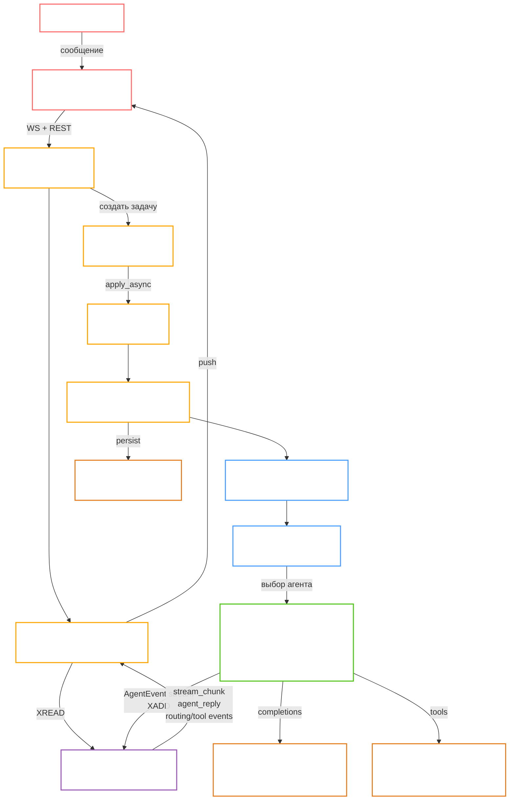

# Interface for AgentsSwarm

> Платформа для работы с ИИ: чат, агентные маршруты, web/deep-research, генерация файлов, память пользователя и фоновые джобы.
> Управление роем роботов через оркестратор.

## Архитектура



## Что внутри проекта

- **Frontend:** React + Chakra UI (`frontend/`)
- **Backend:** FastAPI + SQLAlchemy + Alembic (`backend/`)
- **Очереди и фоновые задачи:** Redis + Celery
- **Хранилище файлов:** MinIO / local storage
- **Инфраструктура:** Docker Compose (dev/prod), Nginx в prod

## Документация

- [Установка и запуск (dev/prod)](./docs/dev_installation.md)
- [Переменные окружения](./docs/env_variables.md)
- [API docs](./docs/api.md)
- [Архитектура](./docs/architecture.md)
- [Agents architecture](./docs/agents.md)

## Структура запуска

- `docker/docker-compose.dev.yaml` — локальная разработка (hot-reload backend + frontend dev server)
- `docker/docker-compose.yaml` — production-стек (frontend + backend + nginx + infra)
- `docker/build.sh` — сборка образов
- `docker/run.sh` — запуск/статус/логи/остановка

## Быстрый старт (для разработчика)

### 1) Подготовка `.env`

```bash
cd docker
cp .env.example .env.dev
cp .env.example .env.prod
```

Заполните обязательные переменные (минимум: `PG__*`, `REDIS__*`, `AUTH__*`, `AGENTS__MWS_API_KEY` или `AGENTS__OPENAI_API_KEY`).

### 2) Сборка и запуск dev

```bash
make build MODE=dev
make run MODE=dev
```

или напрямую:

```bash
cd docker
./build.sh --dev
./run.sh --dev
```

### 3) Проверка после запуска

```bash
cd docker
./run.sh --status
```

Ожидаемые адреса в dev:

- Frontend: `http://localhost:3000`
- Backend API: `http://localhost:8000`
- Swagger: `http://localhost:8000/docs`
- MinIO Console: `http://localhost:9001`

## Управление окружением

```bash
cd docker
./run.sh --logs
./run.sh --logs backend
./run.sh --restart
./run.sh --stop
```

## Запуск в production-режиме

```bash
cd docker
./build.sh --prod
./run.sh --prod
```

По умолчанию в prod используется Nginx, внешние точки:

- `http://<APP_DOMAIN>`
- `http://<APP_DOMAIN>/api`
- `https://<APP_DOMAIN>` (если настроены сертификаты в `infra/nginx/certs`)

## Подготовка к презентации (demo readiness)

Перед показом проверьте:

1. Поднят именно `prod` стек и все контейнеры healthy.
2. В `docker/.env.prod` корректные домен/URL (`SERVICE__APP_DOMAIN`, `SERVICE__REACT_APP_*`).
3. Для HTTPS присутствуют `infra/nginx/certs/certificate.pem` и `infra/nginx/certs/private.pem`.
4. Работают ключевые сценарии:
	- чат по WebSocket,
	- загрузка файла в чат,
	- web search/deep research,
	- генерация презентации/изображения,
	- открывается профиль/память.

## Частые проблемы

- **`craco: not found`** — frontend локально без `node_modules`; используйте docker-сборку или выполните `npm install` в `frontend/`.
- **Сервис не стартует из-за `.env.*`** — проверьте, что файл существует в папке `docker/` и содержит все обязательные переменные.
- **`502` от nginx в prod** — проверьте `./run.sh --status`, затем `./run.sh --logs nginx`.
- **Нет фоновой обработки** — убедитесь, что подняты Celery-профили (`--profile celery` уже включён в `run.sh`).

## Важно по безопасности

- Не коммитьте реальные секреты в `.env.dev` / `.env.prod`.
- Используйте `docker/.env.example` как шаблон и храните production-секреты в защищённом vault/CI secrets.
