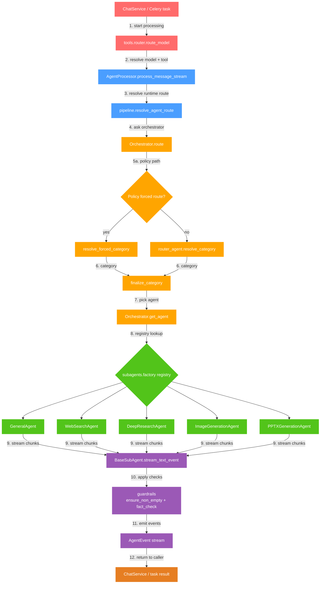
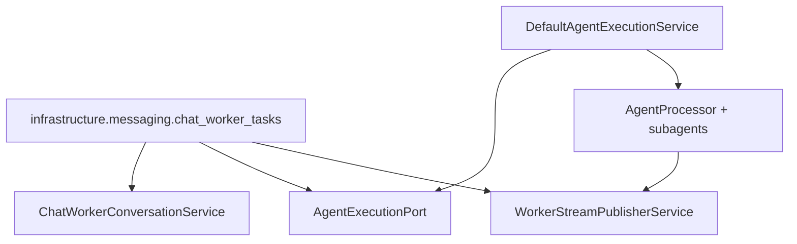

## Mermaid: оркестрация агентского слоя

```mermaid
graph TB
    Entry["ChatService / Celery task"]
    ModelRouter["tools.router.route_model"]
    Processor["AgentProcessor.process_message_stream"]

    ResolveRoute["pipeline.resolve_agent_route"]
    OrchRoute["Orchestrator.route"]
    Policy{"Policy forced route?"}
    Forced["resolve_forced_category"]
    LlmRoute["router_agent.resolve_category"]
    Finalize["finalize_category"]

    GetAgent["Orchestrator.get_agent"]
    Registry{"subagents.factory registry"}
    General["GeneralAgent"]
    WebSearch["WebSearchAgent"]
    DeepResearch["DeepResearchAgent"]
    ImageGen["ImageGenerationAgent"]
    PptxGen["PPTXGenerationAgent"]

    GuardedStream["BaseSubAgent.stream_text_event"]
    Guardrails["guardrails\nensure_non_empty + fact_check"]
    EventStream["AgentEvent stream"]
    Result["ChatService / task result"]

    Entry -->|"1. start processing"| ModelRouter
    ModelRouter -->|"2. resolve model + tool"| Processor
    Processor -->|"3. resolve runtime route"| ResolveRoute
    ResolveRoute -->|"4. ask orchestrator"| OrchRoute

    OrchRoute -->|"5a. policy path"| Policy
    Policy -->|"yes"| Forced
    Policy -->|"no"| LlmRoute
    Forced -->|"6. category"| Finalize
    LlmRoute -->|"6. category"| Finalize

    Finalize -->|"7. pick agent"| GetAgent
    GetAgent -->|"8. registry lookup"| Registry

    Registry --> General
    Registry --> WebSearch
    Registry --> DeepResearch
    Registry --> ImageGen
    Registry --> PptxGen

    General -->|"9. stream chunks"| GuardedStream
    WebSearch -->|"9. stream chunks"| GuardedStream
    DeepResearch -->|"9. stream chunks"| GuardedStream
    ImageGen -->|"9. stream chunks"| GuardedStream
    PptxGen -->|"9. stream chunks"| GuardedStream

    GuardedStream -->|"10. apply checks"| Guardrails
    Guardrails -->|"11. emit events"| EventStream
    EventStream -->|"12. return to caller"| Result

    style Entry fill:#ff6b6b,stroke:#ff6b6b,stroke-width:2px,color:#fff
    style ModelRouter fill:#ff6b6b,stroke:#ff6b6b,stroke-width:2px,color:#fff
    style Processor fill:#4a9eff,stroke:#4a9eff,stroke-width:2px,color:#fff
    style ResolveRoute fill:#4a9eff,stroke:#4a9eff,stroke-width:2px,color:#fff

    style OrchRoute fill:#ffa500,stroke:#ffa500,stroke-width:2px,color:#fff
    style Policy fill:#ffa500,stroke:#ffa500,stroke-width:2px,color:#fff
    style Forced fill:#ffa500,stroke:#ffa500,stroke-width:2px,color:#fff
    style LlmRoute fill:#ffa500,stroke:#ffa500,stroke-width:2px,color:#fff
    style Finalize fill:#ffa500,stroke:#ffa500,stroke-width:2px,color:#fff
    style GetAgent fill:#ffa500,stroke:#ffa500,stroke-width:2px,color:#fff

    style Registry fill:#52c41a,stroke:#52c41a,stroke-width:2px,color:#fff
    style General fill:#52c41a,stroke:#52c41a,stroke-width:2px,color:#fff
    style WebSearch fill:#52c41a,stroke:#52c41a,stroke-width:2px,color:#fff
    style DeepResearch fill:#52c41a,stroke:#52c41a,stroke-width:2px,color:#fff
    style ImageGen fill:#52c41a,stroke:#52c41a,stroke-width:2px,color:#fff
    style PptxGen fill:#52c41a,stroke:#52c41a,stroke-width:2px,color:#fff

    style GuardedStream fill:#9b59b6,stroke:#9b59b6,stroke-width:2px,color:#fff
    style Guardrails fill:#9b59b6,stroke:#9b59b6,stroke-width:2px,color:#fff
    style EventStream fill:#9b59b6,stroke:#9b59b6,stroke-width:2px,color:#fff
    style Result fill:#e67e22,stroke:#e67e22,stroke-width:2px,color:#fff
```

## Flow: boundaries between infrastructure and agents

```mermaid
graph TD
    Worker["infrastructure.messaging.chat_worker_tasks"]
    AgentPort["AgentExecutionPort"]
    AgentAdapter["DefaultAgentExecutionService"]
    Runtime["AgentProcessor + subagents"]
    Streams["WorkerStreamPublisherService"]
    Persistence["ChatWorkerConversationService"]

    Worker --> Persistence
    Worker --> AgentPort
    AgentAdapter --> AgentPort
    AgentAdapter --> Runtime
    Worker --> Streams
    Runtime --> Streams
```
