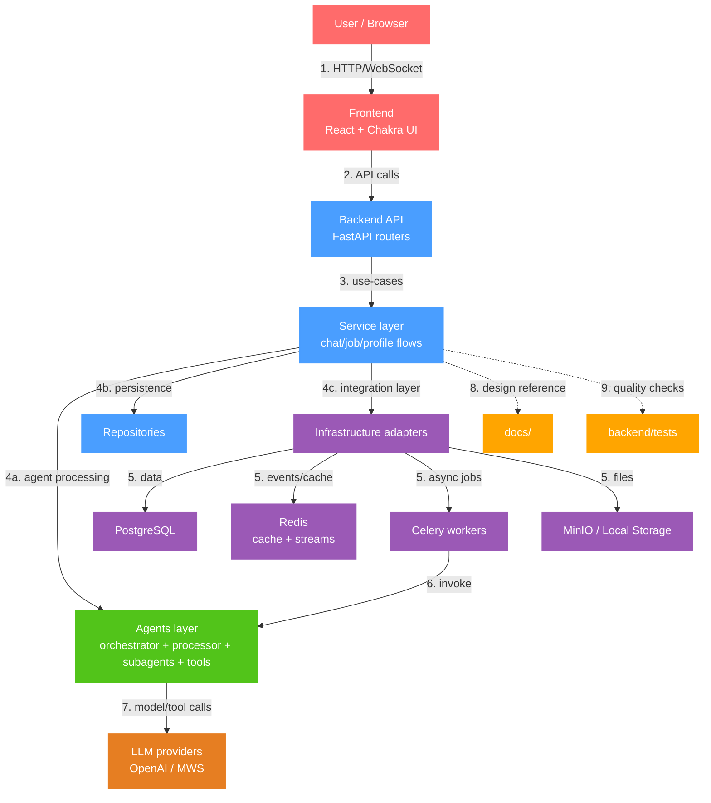
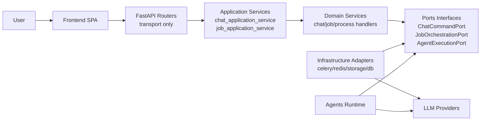
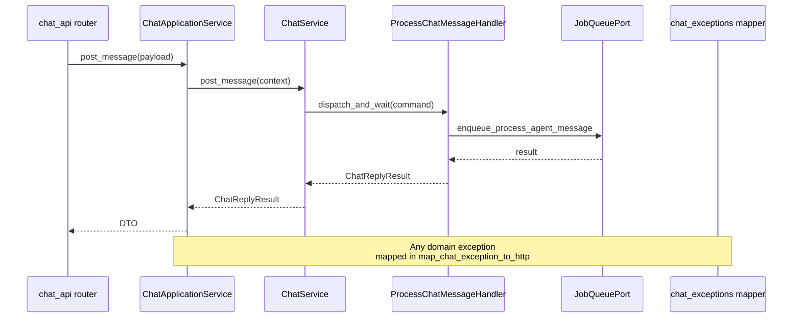

# Архитектура GPTHub

**Последнее обновление:** 2026-04-23

## Контрактный pipeline API

- Источник правды контракта: `FastAPI app.openapi()` из `backend/service/main.py`.
- В CI OpenAPI генерируется командой `python scripts/export_openapi.py --output artifacts/openapi.json`.
- Для критичных операций используется snapshot-проверка `backend/tests/test_critical_endpoint_snapshots.py`.
- Для DTO-моделей ответов используется snapshot-проверка `backend/tests/test_response_schema_snapshots.py`.
- При изменении контракта разработчик обновляет snapshots и документацию `docs/api.md`, `docs/architecture.md`.

## Стабилизированные зоны контракта

К критичным операциям, которые защищены endpoint-snapshot тестом, относятся:

- `POST /api/auth/v1/register`
- `POST /api/auth/v1/login`
- `POST /api/chats/`
- `GET /api/chats/{thread_id}`
- `POST /api/chats/{thread_id}/message`
- `POST /api/jobs/v1/start`
- `GET /api/jobs/v1/result/{job_id}`

## ADR-практика

- ADR хранятся в `docs/adr/`.
- Каждое крупное изменение архитектурного слоя обязательно сопровождается новым ADR.
- Базовые решения по quality gates и метрикам сложности описаны в `docs/adr/0001-quality-gates-and-complexity-metrics.md`.

## Безопасный lifecycle enum в БД

- Enum-контракт приложения фиксируется в `backend/service/models/key_value.py`.
- Enum-контракт схемы фиксируется ревизиями Alembic в `backend/alembic/versions/`.
- Тест `backend/tests/test_enum_schema_contract.py` вычисляет набор значений enum из SQLAlchemy metadata и сравнивает его с итоговым состоянием по цепочке Alembic ревизий.
- CI шаг `python scripts/check_enum_revision_guard.py <base> <head>` блокирует PR, если enum-модели изменены без новой ревизии в `backend/alembic/versions/`.
- Для каждого enum-change используется шаблон `backend/alembic/templates/enum_change_template.py` с обязательными блоками `upgrade`, `downgrade`, `backfill`, `data-check`.

## Mermaid: верхнеуровневая схема проекта

## C4: Container boundaries after application services split

## Flow: Chat message orchestration with error mapping

## UI boundaries (enforced)
- All reusable UI components are located only in `frontend/src/shared/ui`.
- Feature modules must not import components from other features directly; shared UI is consumed via `@shared/ui/*` public API only.
